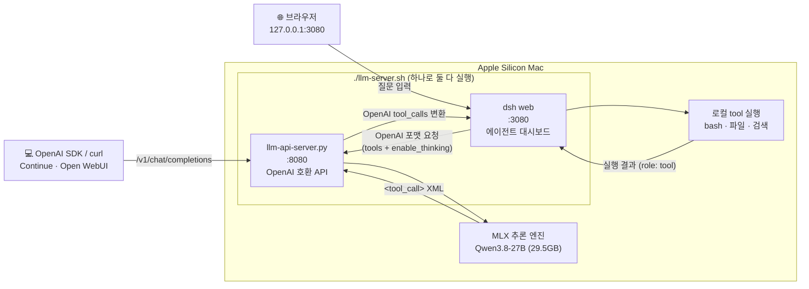

# Local LLM Server (MLX)

**한국어** | [English](README.md)

> **Apple Silicon Mac 전용** (M1/M2/M3/M4/M5)
> MLX는 Apple의 네이티브 ML 프레임워크로, Apple Silicon에서만 동작합니다.
> NVIDIA GPU / Intel Mac / Windows / Linux는 지원하지 않습니다.

Apple Silicon Mac에서 로컬 LLM을 OpenAI 호환 API 서버로 실행하는 프로젝트.
OpenAI SDK 호환 클라이언트를 그대로 연결해 완전히 로컬에서 추론하며,
tool calling(function calling)을 지원해 dsh 같은 에이전트 하네스도 붙습니다 —
`./llm-server.sh` 하나로 API 서버(:8080)와 dsh 에이전트 대시보드(:3080)가 함께 뜹니다.

---

## 지원 모델

| 모델 | 실행 명령 | 메모리 | 속도 | 특징 |
|------|----------|------:|-----:|------|
| **Qwen3.8-27B-8bit** (기본) | `./llm-server.sh` | ~30GB (피크 34GB) | ~9.8 tok/s³ | 멀티모달(이미지), Thinking 기본 OFF, 요청별 ON 가능, preserve_thinking 지원, mlx-vlm 런타임 |
| **Qwen3.6-27B-6bit** (이전 기본) | `./llm-server.sh qwen36` | ~23GB | ~12 tok/s³ | 위와 동일 기능 — 메모리 32~48GB 환경용 |
| **Qwen3.6-35B-A3B-8bit** (빠른 프로필) | `./llm-server.sh qwen36-fast` | ~37GB | 3~4배⁴ | MoE(활성 3B) 멀티모달. 대량·반복 작업용 — 품질은 27B dense가 우위 |
| **SuperGemma4-26B uncensored-v2** | `./llm-server.sh supergemma4` | ~13GB | 46 tok/s | 무검열(파인튜닝), 툴콜·한국어·코드 강화, 텍스트 전용 |
| **SuperGemma4-26B abliterated-multimodal** | `./llm-server.sh supergemma4-vlm`¹ | ~15GB | ~49 tok/s | 무검열(EGA), 이미지+텍스트 입력 지원 |

두 모델 동시 로드는 불가 (메모리 초과). 서버 재시작으로 전환.

> ¹ `supergemma4`는 텍스트 전용 uncensored-v2를 실행 (`supergemma4-text` 별칭 동일). 멀티모달 variant는 `supergemma4-vlm` 프로필 또는 `python llm-api-server.py --model Jiunsong/supergemma4-26b-abliterated-multimodal-mlx-4bit`로 실행.

> ³ M5 Pro 64GB 실측 (MTP speculative decoding ON, block_size=6). Qwen3.8-8bit는 2026-08-18, Qwen3.6-6bit는 2026-08-02 측정. Dense 27B 모델의 이론 상한을 MTP가 약 60% 개선.

> ⁴ 27B dense 대비 상대 속도(공개 벤치 기준, 본 프로젝트 미실측). Qwen 공식 벤치에서 27B dense가 35B-A3B를 전 항목에서 앞서며 SkillsBench(코딩 에이전트)는 +15.5점 차이 — 기본 모델은 27B를 유지한다.

### 모델별 지원 기능

| 기능 | Qwen3.8-27B (기본) / Qwen3.6-27B | SuperGemma4 uncensored-v2 | SuperGemma4 abliterated-multimodal |
|------|:-----------------:|:------------------------:|:---------------------------------:|
| 컨텍스트 프로필 (1m/262k) | ✅ | ❌ (128K 고정) | ❌ (256K 고정) |
| Thinking 모드 (`enable_thinking`) | ✅ (기본 OFF) | ❌ | ❌ |
| Tool calling (`tools`) | ✅ (Qwen3.8 실측) | 미검증 | 미검증 |
| 대화형 채팅 (`llm-chat.sh`) | ✅ | ❌ | ❌ |
| 이미지 입력 (멀티모달) | ✅ | ❌ | ✅ |
| 영상 입력 | ❌ | ❌ | ❌ |

### Qwen3.6 → Qwen3.8 전환 (2026-08-18, 현재)

| 항목 | Qwen3.6-27B-6bit *(이전 기본)* | Qwen3.8-27B-8bit *(현재 기본)* |
|------|:------------------------------:|:------------------------------:|
| **아키텍처** | Dense 27B (`qwen3_5`) | Dense 27B (`qwen3_5`) — **동일, 모델 ID만 교체** |
| **양자화** | 6bit (~22.8GB) | 8bit (~29.5GB) — 3.8은 6bit 변환본 없음 |
| **실측 메모리** | ~23GB | 피크 ~34GB |
| **실측 속도 (MTP ON)** | ~12 tok/s | ~9.8 tok/s |
| **컨텍스트** | 262K / 1M (YaRN) | 262K / 1M (YaRN 설정 동일 적용, 3.8 실측 미완) |
| **Tool calling** | 미검증 | ✅ 실측 검증 (dsh E2E 포함) |
| **Thinking** | ✅ | ✅ (전환 직후 무음 no-op 버그 있었음 → 2026-08-18 수정) |
| **런타임** | mlx-vlm 0.6.12 | mlx-vlm 0.6.13 (Qwen3.5 계열 디코드 수정 포함) |

bf16(54GB)은 64GB Mac에서 wired memory limit 때문에 비실용이라 8bit를 선택.
아키텍처가 동일해 코드 변경 없이 전환됐고, 속도를 조금 내주는 대신 상위 세대 품질을 얻는 트레이드오프.

### Qwen3.5 → Qwen3.6 전환 및 3모델 비교 (히스토리)

> 아래는 그 전 단계였던 Qwen3.5 → 3.6 전환 기록.

| 항목 | Qwen3.5-35B-A3B *(이전)* | Qwen3.6-27B-6bit *(당시 기본)* | SuperGemma4-26B uncensored-v2 |
|------|:------------------------:|:------------------------------:|:-----------------------------:|
| **아키텍처** | MoE 35B (활성 A3B) | **Dense 27B** | MoE 26B |
| **런타임** | `mlx-lm` | `mlx-vlm` | `mlx-lm` |
| **메모리** | ~20GB | ~23GB | ~13GB |
| **생성 속도** | ~103 tok/s | ~12 tok/s³ | ~46 tok/s |
| **컨텍스트** | 262K / 1M (YaRN) | 262K / 1M (YaRN) | 128K 고정 |
| **이미지 입력** | ❌ | ✅ | ❌ |
| **Thinking 모드** | ✅ | ✅ **(기본 OFF)** | ❌ |
| **검열 해제** | ❌ | ❌ | ✅ (파인튜닝) |
| **한국어/코딩 강화** | 기본 | 기본 | ✅ (파인튜닝) |
| **툴 콜 강화** | 기본 | 기본 | ✅ (2배↑) |
| **대화형 채팅** | ✅ | ✅ | ❌ |
| **MMLU-Pro** | - | **86.2** | 82.6 |
| **SWE-bench Verified** | - | **77.2** | - |
| **GPQA Diamond** | - | **87.8** | 82.3 |

Qwen3.6은 파라미터가 줄었지만 Dense 아키텍처로 전환 + 멀티모달 추가 + Thinking 기본 OFF, 요청별 ON 가능. 속도는 MoE였던 3.5보다 느리지만 이미지·Thinking 지원이 핵심 차이.

---

## 요구사항

| 항목 | 최소 | 권장 |
|------|------|------|
| Mac | Apple Silicon (M1+) | M3 Pro / M4 Pro 이상 |
| 메모리 | 24GB (경량 모델) | 48~64GB |
| Python | 3.10+ | 3.11+ |
| 디스크 | 20GB 여유 | 50GB+ |

**메모리 사양은 용도별로 다릅니다** — 모델 가중치 외에 KV cache, vision 인코더, Metal 임시 버퍼가 추가로 필요합니다:

| 메모리 | 현실적인 용도 |
|--------|--------------|
| 24GB | 경량 모델(SuperGemma4 등) 전용. 27B 모델은 로드는 되어도 swap/OOM 위험 — 짧은 컨텍스트 실험용 |
| 32GB | Qwen3.6-27B-6bit 단문 사용의 현실적 최소 |
| 48GB | Qwen3.8-27B-8bit 사용 가능 (실측 피크 34GB) |
| 64GB | 멀티모달 + 긴 컨텍스트 권장. 262K 실사용 가능 |

> 1M 컨텍스트는 모델/YaRN 설정상 상한이며, 어떤 메모리 구성에서도 "1M을 채워서" 실용적으로 쓸 수 있다는 의미는 아닙니다.

---

## 설치

```bash
git clone https://github.com/LeeKiYoung/local-llm.git
cd local-llm
./setup.sh
```

`setup.sh`가 자동으로:
1. Apple Silicon / Python / 메모리 확인
2. 메모리에 맞는 모델 선택 메뉴 표시
3. 가상환경 생성 + **mlx-vlm==0.6.13 / mlx==0.32.0** (Qwen MTP/KV cache/MRoPE 수정, APC 포함) + FastAPI + uvicorn 설치
4. 선택한 모델 다운로드 + 스크립트에 자동 반영

| # | 모델 | 메모리 | 특징 |
|:-:|------|------:|------|
| 1 | **Qwen3.8-27B-8bit** ⭐ | ~30GB | VLM, 텍스트+이미지, Thinking 기본 OFF (48GB+ 권장) |
| 2 | **Qwen3.6-27B-6bit** | ~23GB | VLM (이전 기본, 32~48GB 환경용) |
| 3 | **SuperGemma4-26B** (무검열) | ~16GB | 무검열 보조 모델 (텍스트 전용) |
| 4 | 직접 입력 | - | Hugging Face 모델 ID |

메모리에 따라 자동 추천이 표시됩니다. Enter만 누르면 추천 모델(Qwen3.8-27B-8bit)로 설치됩니다.

### 환경만 셋업 (모델 나중에)

```bash
./setup.sh --no-model
```

### 모델은 어디에 저장되나요?

첫 실행 시 모델이 자동 다운로드되며, 기본 경로에 저장됩니다:

```
~/.cache/huggingface/hub/models--mlx-community--Qwen3.8-27B-8bit/    (~29.5GB)
```

경로를 바꾸고 싶다면 (외장 SSD 등):

```bash
# ~/.zshrc에 추가
export HF_HOME=/Volumes/MySSD/.huggingface

source ~/.zshrc && ./setup.sh
```

---

## 프로젝트 구조

```
local-llm/
├── setup.sh                              # 자동 셋업 (환경 + 모델 + 의존성)
├── llm-chat.sh                           # 대화형 채팅
├── llm-server.sh                         # API 서버 실행
├── llm-api-server.py                     # FastAPI 커스텀 API 서버 (핵심)
├── llm-proxy.py                          # 투명 로깅 프록시 (선택적 사용)
├── profiles/
│   ├── config-qwen36-27b-262k.json       # 기본 프로필 (262K, Qwen3.6-27B)
│   └── config-qwen36-27b-1m.json         # 확장 프로필 (1M YaRN, Qwen3.6-27B)
├── tests/
│   ├── test_api_server.py                # API 서버 테스트
│   ├── test_tool_calling.py              # tool calling / thinking 테스트
│   ├── test_stats.py                     # 대시보드 집계 테스트
│   └── test_proxy.py                     # 프록시 테스트 (전체 108개)
├── local-llm-guide-2026.md               # 모델 비교 가이드 문서
├── .venv/                                # Python 가상환경
└── logs/                                 # 요청/응답 JSONL 로그 (자동 생성)
```

---

## 빠른 시작 (Quick Start)

### 1단계: 셋업

```bash
git clone https://github.com/LeeKiYoung/local-llm.git
cd local-llm
./setup.sh
```

### 2단계: 서버 시작

```bash
# Qwen3.8-27B (기본) — API 서버 + dsh 대시보드 함께 실행
./llm-server.sh

# 1M 컨텍스트 모드
./llm-server.sh 1m

# Qwen3.6-35B-A3B (MoE, 빠른 프로필)
./llm-server.sh qwen36-fast

# SuperGemma4
./llm-server.sh supergemma4
```

### 3단계: 요청 보내기

```bash
curl http://localhost:8080/v1/chat/completions \
  -H "Content-Type: application/json" \
  -d '{
    "messages": [{"role": "user", "content": "안녕!"}],
    "max_tokens": 200
  }'
```

---

## 사용 가이드

### 1. 대화형 채팅

```bash
./llm-chat.sh           # 262K
./llm-chat.sh 1m        # 1M 컨텍스트
./llm-chat.sh 262k      # 명시적 262K
```

추가 옵션:

```bash
./llm-chat.sh 1m --temp 0.3
./llm-chat.sh --max-tokens 4000
./llm-chat.sh --system-prompt "한국어로만 답해줘"
```

대화 예시:

```
✅ 1M 컨텍스트 (YaRN) 적용 완료

🚀 채팅 시작 (종료: Ctrl+C)

>> 파이썬으로 피보나치 함수 짜줘
def fibonacci(n):
    a, b = 0, 1
    for _ in range(n):
        a, b = b, a + b
    return a
```

### 2. API 서버

OpenAI 호환 API 서버. FastAPI + mlx_vlm Python API로 직접 추론.
같은 네트워크의 다른 기기(맥미니 등)에서 접속 가능.

```bash
# Qwen3.8-27B (기본)
./llm-server.sh              # 262K 컨텍스트, Thinking OFF, MTP ON, dsh 대시보드 자동 실행
./llm-server.sh 1m           # 1M 컨텍스트 (YaRN)
./llm-server.sh 262k 9090    # 포트 지정
./llm-server.sh --think      # Thinking 기본 ON
./llm-server.sh --no-mtp     # MTP speculative decoding 비활성화
./llm-server.sh --no-apc     # APC prefix caching 비활성화
./llm-server.sh --no-dsh     # dsh 대시보드 없이 API 서버만

# Qwen3.6-27B (이전 기본, 32~48GB 환경용)
./llm-server.sh qwen36

# Qwen3.6-35B-A3B (MoE, 빠른 프로필)
./llm-server.sh qwen36-fast          # 첫 실행 시 ~37GB 자동 다운로드

# SuperGemma4
./llm-server.sh supergemma4          # 첫 실행 시 ~16GB 자동 다운로드
./llm-server.sh supergemma4 9090     # 포트 지정
```

실행하면:

```
🌐 API 서버 시작
   로컬:     http://localhost:8080
   네트워크: http://<YOUR_LOCAL_IP>:8080
   대시보드: http://localhost:8080/dashboard

   엔드포인트: /v1/chat/completions
   스트리밍: stream=true 지원
```

#### 기본 호출

```bash
curl http://localhost:8080/v1/chat/completions \
  -H "Content-Type: application/json" \
  -d '{
    "messages": [{"role": "user", "content": "안녕!"}],
    "max_tokens": 200
  }'
```

#### 스트리밍

```bash
curl http://localhost:8080/v1/chat/completions \
  -H "Content-Type: application/json" \
  -d '{
    "messages": [{"role": "user", "content": "안녕!"}],
    "stream": true,
    "max_tokens": 200
  }'
```

#### 이미지 포함 요청 (멀티모달)

```bash
# 이미지 포함 요청 (base64)
curl http://localhost:8080/v1/chat/completions \
  -H "Content-Type: application/json" \
  -d '{
    "messages": [{"role": "user", "content": [
      {"type": "text", "text": "이 이미지를 설명해줘"},
      {"type": "image_url", "image_url": {"url": "data:image/jpeg;base64,..."}}
    ]}],
    "max_tokens": 500
  }'
```

> 원격 `http(s)` image_url은 기본 비활성 (SSRF 방지) — `data:image/...;base64`만 허용.
> 원격 URL이 필요하면 서버를 `--allow-remote-images`로 실행.

#### 요청별 Thinking 제어

```bash
# Thinking 활성화 (기본 OFF → 이 요청만 ON)
curl http://localhost:8080/v1/chat/completions \
  -d '{"messages":[{"role":"user","content":"123*456=?"}],"enable_thinking":true,"preserve_thinking":true,"max_tokens":500}'
```

#### 지원 파라미터 (OpenAI 호환)

| 파라미터 | 타입 | 기본값 | 설명 |
|---------|------|--------|------|
| `model` | string | 서버 모델 | 모델 ID |
| `messages` | array | 필수 | 대화 메시지 |
| `stream` | bool | false | SSE 스트리밍 |
| `temperature` | float | 1.0 | 샘플링 온도 |
| `top_p` | float | 1.0 | Nucleus sampling |
| `max_tokens` | int | 2048 | 최대 생성 토큰 |
| `max_completion_tokens` | int | - | max_tokens 별칭 |
| `stop` | string/array | null | 정지 시퀀스 (현재 미적용) |
| `seed` | int | null | 결정적 샘플링 (OpenAI 호환용, 모델에 전달되지 않음) |
| `presence_penalty` | float | 0 | 존재 패널티 (OpenAI 호환용, 모델에 전달되지 않음) |
| `frequency_penalty` | float | 0 | 빈도 패널티 (OpenAI 호환용, 모델에 전달되지 않음) |
| `repetition_penalty` | float | null | 반복 패널티 (파싱됨, 현재 모델에 전달되지 않음) |
| `enable_thinking` | bool | false | Thinking 모드 (기본 OFF, 요청별 ON 가능, Qwen3.8/3.6 지원) |
| `preserve_thinking` | bool | false | true 시 thinking 텍스트 그대로 포함, false 시 `</think>` 이후 답변만 반환 |
| `tools` | array | null | OpenAI function calling 스키마 — 채팅 템플릿에 전달됨 |
| `tool_choice` | string | null | `"none"`이면 tools 무시 (그 외 값은 미지원) |

#### Tool Calling (Function Calling)

OpenAI 호환 tool calling을 지원한다 (2026-08-18, 스트리밍 포함). 모델이 함수를 호출하면
`finish_reason: "tool_calls"`와 함께 OpenAI 포맷 `tool_calls`가 반환된다
(`arguments`는 JSON 문자열). 스트리밍에서는 `<tool_call>` 감지 시 content 출력을 멈추고
스트림 끝에 tool_calls delta 청크 한 번으로 내보낸다.

```bash
curl http://localhost:8080/v1/chat/completions \
  -d '{"messages":[{"role":"user","content":"서울 날씨 알려줘"}],
       "tools":[{"type":"function","function":{"name":"get_weather",
         "parameters":{"type":"object","properties":{"city":{"type":"string"}},"required":["city"]}}}]}'
# → {"finish_reason":"tool_calls","message":{"tool_calls":[{"function":{"name":"get_weather","arguments":"{\"city\": \"서울\"}"}}]}}
```

tool 결과는 표준 OpenAI 방식(`role: "tool"` + `tool_call_id`)으로 회신하면 된다.
참고: Qwen3.8 채팅 템플릿은 XML 스타일(`<function=...><parameter=...>`) tool call 포맷을
쓰며, 서버가 이를 OpenAI 포맷으로 변환한다.

### 사용 방법 두 가지: API 직접 호출 vs dsh 대시보드

이 서버는 두 가지 방식으로 쓸 수 있다:

1. **API 직접 호출** — OpenAI SDK 호환 클라이언트(curl, Python SDK, Continue 등)가
   `http://localhost:8080/v1`을 직접 호출. 위의 사용 예시들이 전부 이 방식.
2. **dsh 에이전트 대시보드** — 브라우저에서 질문을 던지면 에이전트가 tool
   (bash, 파일 읽기/쓰기 등)을 써가며 스스로 작업을 완수하는 웹 UI.



**동작 플로우** (dsh 대시보드로 "server.log 줄 수 세줘"를 물으면):

1. 브라우저 → dsh가 질문을 OpenAI 포맷으로 변환해 `:8080`에 전달 (tools 스키마 포함)
2. 서버가 Qwen 채팅 템플릿에 tools를 넣어 추론 → 모델이 `<tool_call>` XML로 함수 호출
3. 서버가 XML을 OpenAI `tool_calls` 포맷으로 변환해 응답 (`finish_reason: "tool_calls"`)
4. dsh가 로컬에서 tool(bash 등)을 실제 실행 → 결과를 `role: "tool"` 메시지로 다시 전달
5. 필요하면 2~4를 반복하다가 모델이 최종 답변 생성 → 브라우저에 표시

모든 단계가 로컬에서 처리되고 외부 API 호출은 없다.

#### 접속 방법

```bash
./llm-server.sh          # API 서버(:8080) + dsh 대시보드(:3080) 함께 실행
./llm-server.sh 1m       # 1M 컨텍스트로 실행 (dsh 동일하게 자동 실행)
./llm-server.sh --no-dsh # API 서버만
```

- **대시보드**: 서버 배너에 뜨는 http://127.0.0.1:3080 클릭 → 질문창에 바로 입력
- **API**: `http://localhost:8080/v1` (같은 네트워크면 `http://<로컬IP>:8080/v1`)
- 서버를 Ctrl+C로 끄면 dsh 대시보드도 함께 종료된다

#### dsh 설정 (`~/.dsh/settings.yaml`)

dsh 설치는 `setup.sh`에서 선택하거나 `npm install -g @deepseek-ai/dsh`.
로컬 서버 연결 설정:

```yaml
llm-pi-ai:
  providers:
    local-mlx:
      displayName: Local MLX
      apiKeyEnv: LOCAL_LLM_API_KEY   # 로컬 서버는 인증 없음 — dummy 값이면 됨
      api: openai-completions
      baseURL: http://localhost:8080/v1
      defaultInput: [text, image]
      defaultContextWindow: 262144
      defaultMaxTokens: 8192
      models:
        - id: mlx-community/Qwen3.8-27B-8bit
          name: Qwen3.8 27B (local MLX)
          # thinking 제어: pi-ai의 qwen 다이얼렉트가 top-level enable_thinking을 전송
          compat:
            thinkingFormat: qwen
          reasoningEfforts:
            off:
            high: high

agent-default-model:
  provider: local-mlx
  model: mlx-community/Qwen3.8-27B-8bit
  reasoningEffort: off   # off=thinking 없음(빠름), high=thinking ON(느리지만 정확)
```

thinking ON(`reasoningEffort: high`)일 땐 서버가 `</think>`까지 버퍼링 후 답변만
스트리밍하므로 첫 토큰이 thinking 시간만큼 늦게 보인다 (멈춘 게 아님).
참고: pi-ai는 reasoning 모델에 `developer` role을 보내는데 서버가 `system`으로 자동 매핑한다.

웹 UI 말고 터미널에서 단발 실행도 가능:

```bash
LOCAL_LLM_API_KEY=local dsh --profile headless "현재 디렉토리 파일 개수 알려줘"
```

#### 웹 UI 연동

Continue, Open WebUI 등에서 OpenAI endpoint로 연결:
- URL: `http://<YOUR_LOCAL_IP>:8080/v1`
- API Key: 아무 값 (인증 없음)

#### 외부 네트워크에서 접속 (Tailscale)

```bash
brew install tailscale
# 양쪽 기기에서 Tailscale 로그인 후
curl http://<TAILSCALE_IP>:8080/v1/chat/completions ...
```

#### 아키텍처

```
클라이언트(:8080) → FastAPI 서버 (mlx_vlm API 직접 호출)
```

- `asyncio.Semaphore(1)` — GPU 순차 처리, HTTP는 동시 수신
- 대기 큐 5개 초과 시 429 응답 (OOM 방지)
- **MTP Speculative Decoding** — Qwen3.8/3.6 내장 MTP 헤드 활용, 기본 ON (아래 섹션 참고)
- **Prompt KV 캐시 재사용** — 멀티턴 대화에서 공통 prefix 스킵, 두 번째 턴부터 TTFT 단축 (`PromptCacheState`)
- **Vision 인코더 캐시** — 같은 이미지 재전송 시 비전 인코더 스킵 ~1-2초 절약 (`VisionFeatureCache`)
- **Prefill 청크 최적화** — 긴 프롬프트를 512토큰 청크로 나눠 Metal 커널 효율 향상 (`prefill_step_size`)
- Metal GPU 임시 버퍼는 요청 완료 후 해제 (`mx.clear_cache()`), KV 캐시 배열은 eval 후 보존

### 3. 로깅

서버에 로깅이 **내장**되어 있습니다. 두 모델 모두 동일하게 기록.

```
logs/
├── 2026-04-15.jsonl
└── 2026-04-16.jsonl
```

| 항목 | 내용 |
|------|------|
| timestamp | 요청 시각 |
| ip | 호출한 기기 IP |
| duration_ms | 응답 시간 (ms) |
| enable_thinking | Thinking ON/OFF |
| stream | 스트리밍 여부 |
| prompt_preview | 프롬프트 미리보기 (200자) |
| content_preview | 응답 미리보기 (200자) |
| usage | 토큰 사용량 (prompt / completion / total) |

```bash
# 오늘 로그 보기
cat logs/$(date +%Y-%m-%d).jsonl | python3 -m json.tool

# IP별 호출 횟수
cat logs/*.jsonl | jq -r '.ip' | sort | uniq -c | sort -rn

# 느린 요청 찾기 (3초 이상)
cat logs/*.jsonl | jq 'select(.duration_ms > 3000)'
```

#### 웹 대시보드

서버가 떠 있으면 **http://localhost:8080/dashboard** 에서 위 로그를 그래프로 볼 수 있습니다.
서버에 내장되어 있어 별도 프로세스나 Docker/Grafana 없이 동작하고, 외부 CDN을 전혀 쓰지
않으므로 오프라인에서도 그대로 뜹니다. 서버를 내리면 대시보드도 같이 내려갑니다.

| 패널 | 내용 |
|------|------|
| 요약 카드 | 총 요청 수, 총 토큰, 평균 토큰/초, p50 / p90 응답 시간 |
| 일별 요청 수 | 날짜별 요청 건수 |
| 일별 토큰 | prompt vs completion 토큰 비교 |
| 응답 시간 백분위 | p50 / p90 / p99 / max |
| 비율 | Thinking ON/OFF, Streaming ON/OFF, 종료 사유(stop/length) |
| 최근 요청 | 최근 50건 (시각, IP, 응답 시간, 토큰, 프롬프트) |

툴바에서 기간(1/7/30일)과 **자동 갱신 주기(끄기/5초/10초/30초, 기본 10초)** 를 고를 수 있습니다.
자동 갱신은 페이지를 다시 불러오지 않고 `/api/stats` 결과만 교체하며, 탭이 숨겨져 있으면
폴링을 멈췄다가 돌아올 때 즉시 한 번 갱신합니다.

집계 데이터는 `GET /api/stats` 로 직접 받을 수도 있습니다.

```bash
# 기본 7일
curl -s localhost:8080/api/stats | jq

# 기간 지정 (1~30일, 범위를 벗어나면 자동 보정)
curl -s "localhost:8080/api/stats?days=30" | jq '.duration_ms'
```

> `days`는 **롤링 24시간이 아니라 날짜 파일 단위**입니다. `days=1`은 오늘 자
> `logs/YYYY-MM-DD.jsonl` 하나만 읽으므로, 자정 직후에는 어제 밤 요청이 잡히지 않습니다.
> 그 구간까지 보려면 `days=2` 이상을 쓰세요.

---

## 컨텍스트 프로필 시스템

> Qwen3.8/3.6-27B 지원. SuperGemma4는 128K/256K 고정, 이 시스템 해당 없음.
> 1M YaRN 설정은 Qwen3.6에서 검증된 값을 3.8에 그대로 적용 중 (3.8에서 1M 실측은 미완).

262K(기본)와 1M(확장) 두 가지 프로필. `config.json` 교체 방식으로 전환.

```bash
# 채팅에서 전환
./llm-chat.sh 1m       # 1M 전환 후 채팅 시작
./llm-chat.sh 262k     # 262K 전환 후 채팅 시작

# API 서버에서 전환
./llm-server.sh 1m     # 1M 전환 후 서버 시작
./llm-server.sh 262k   # 262K 전환 후 서버 시작
```

| 프로필 | 컨텍스트 | 메모리 | 용도 |
|-------|-------:|------:|------|
| 262K (기본) | ~52만 글자 | ~22-25GB | 일반 대화, 코딩 |
| 1M (YaRN) | ~200만 글자 | ~34GB | 대형 문서/코드베이스 분석 |

- 전환 후 **재시작 필요** (Ctrl+C → 다시 실행)
- 1M 모드는 짧은 프롬프트에서 품질 약간 저하 가능 (Static YaRN 특성)
- 평소에는 262K로 충분. 정말 긴 문서 작업할 때만 1M 권장

### 동작 원리

YaRN(Yet another RoPE extensioN)으로 위치 인코딩을 스케일링.

| 설정 | 262K | 1M |
|------|------|-----|
| rope_type | `"default"` | `"yarn"` |
| factor | (없음) | `4.0` |
| original_max_position_embeddings | (없음) | `262144` |

---

## MTP Speculative Decoding

> Qwen3.8/3.6-27B 지원. 모델에 내장된 MTP(Multi-Token Prediction) 헤드를 활용.

### 개요

MTP는 Qwen3.8/3.6-27B 모델 가중치에 `mtp_num_hidden_layers: 1`로 **내장된 초안 헤드**를 이용한 Speculative Decoding 기법입니다. 별도 드래프트 모델 없이 한 번의 포워드 패스에서 여러 토큰 후보를 예측하고, 검증이 통과되면 한 스텝에 여러 토큰을 확정합니다.

- **출력 품질 완전 동일** — Speculative Decoding은 손실이 없음(lossless). 일반 추론과 통계적으로 동일한 분포 보장
- **디코딩 속도 향상** — 내장 MTP 헤드가 6토큰씩 선투기, M5 Pro 기준 이론 상한(~7.6 tok/s) 대비 약 60% 개선
- **추가 메모리 없음** — 드래프트 헤드가 메인 모델에 내장, 별도 가중치 불필요

### 기본값: ON

```
🚀 MTP: ON (mtp, block_size=6)
```

서버 시작 시 자동 활성화. `draft_kind="mtp"`, `draft_block_size=6`이 `generate()` 호출에 전달됩니다.

### 비활성화

```bash
./llm-server.sh --no-mtp
```

비교용 또는 MTP가 불필요한 경우에만 사용.

### 요구사항

- mlx-vlm **0.6.13** 고정 (Qwen MTP prefill, quantized KV cache, MRoPE 위치 수정 포함)
- `setup.sh`가 자동으로 설치: `pip install mlx-vlm==0.6.13 mlx==0.32.0`
- 구버전 설치 시 서버 시작 시 자동 감지 후 graceful fallback (MTP 비활성화 경고 출력)

---

## APC (Prefix Caching)

> mlx-vlm 0.6.5+ 의 Automatic Prefix Caching. 기본 ON.

### 개요

APC는 요청 간 **공통 프리픽스의 KV 블록을 재사용**해 프리필을 건너뜁니다. dsh처럼
매 요청에 동일한 시스템 프롬프트를 붙여 보내는 에이전트 클라이언트에서 TTFT(첫 토큰까지
시간)가 줄어듭니다.

- **출력 품질 영향 없음** — 이미 계산된 KV를 재사용할 뿐, 샘플링에는 관여하지 않음
- **모델별 격리** — 디스크 캐시 namespace를 model_id로 파생하므로 `qwen36` / `qwen36-fast`가
  같은 디렉터리를 써도 서로의 KV 블록을 재사용하지 않음
- 기존 `PromptCacheState`(직전 턴 KV 재사용) / `VisionFeatureCache`(이미지 재인코딩 방지)와 **병행 동작**

### ⚠️ Qwen3.6-27B에서의 실측 결과 (2026-08-02, M5 Pro 64GB)

**이 모델에서는 APC 이득이 확인되지 않았습니다.** 기본값은 ON이되 **메모리 전용**입니다.

- Qwen3.6-27B는 hybrid 구조(`linear_attention` + `full_attention`)라 recurrent state를
  K/V 블록 concat으로 복원할 수 없습니다. `model_apc_mode()`가 `"block"`이 아닌
  **`"exact"`(전체 프롬프트 스냅샷)** 모드를 선택합니다.
- 직전 캐시를 축출시킨 뒤 동일 프리픽스를 재요청하는 실험에서 **히트 0회**
  (A 4.83s → C 4.57s, 사실상 콜드와 동일). 디스크만 1.4GB 소모했습니다.
- `dispatch.py`는 `reused_prefix_len == 0`일 때만 APC를 조회합니다. 즉 `PromptCacheState`가
  **몇 토큰짜리 사소한 매치**만 잡아도 APC 조회가 통째로 스킵됩니다.

체감 속도 향상(TTFT 12.27s → 0.44s)은 APC가 아니라 **기존 `PromptCacheState`**가 내고 있습니다.
dsh 같은 순차 대화 패턴은 이미 이쪽에서 커버됩니다.

block 모드를 지원하는 모델(non-hybrid)로 바꾸면 APC가 의미 있어질 수 있습니다.

### 기본값: ON (메모리 전용)

```
♻️  APC: ON (prefix caching, 메모리 전용)
```

### 비활성화 / 디스크 영속

```bash
./llm-server.sh --no-apc                             # 끄기
python llm-api-server.py --apc-dir .apc-cache        # 디스크 영속 활성화
python llm-api-server.py --apc-max-gb 50             # 디스크 상한 변경 (0이면 무제한)
```

`llm-server.sh`는 `--apc-dir`를 넘기지 않습니다(= 메모리 전용). 디스크 영속이 필요하면
`llm-api-server.py`를 직접 실행하세요.

### 알려진 제약

이미지가 포함된 요청은 `prompt_cache_state`를 비활성화합니다(Metal KV 정합성 가드).
APC 자체는 멀티모달 프리픽스를 인식하지만, 이 가드는 유지되고 있습니다.

---

## Thinking 모드

> Qwen3.8/3.6-27B 지원. SuperGemma4에서 `enable_thinking`을 보내도 오류는 없지만 무시됩니다. 서버가 자동 감지 처리.

Thinking 기본 OFF (DEFAULT_THINKING=False). 요청 시 enable_thinking=true로 ON 가능. `preserve_thinking=true` 요청 시 thinking 텍스트가 응답에 포함됩니다. 기본값(false)은 thinking 블록을 제거하고 최종 답변만 반환합니다.

> ⚠️ 2026-08-18 수정: enable_thinking이 Qwen3.8 전환 후 조용히 무시되던 버그
> (`chat_template_kwargs` 중첩 전달이 템플릿에서 무시됨)를 top-level kwarg 전달로 고쳤습니다.

> **동작 메커니즘**: Qwen 채팅 템플릿이 `<think>` 시작 태그를 프롬프트 prefix로 자동 주입합니다. 따라서 모델 생성 텍스트에는 `</think>` 끝 태그만 나타나며, `<think>...</think>` 완성 형태로 생성되지 않습니다. `preserve_thinking=false`(기본값) 시 서버가 `</think>` 기준으로 이전 내용을 모두 제거하고 이후 답변 텍스트만 반환합니다. 스트리밍(`stream=true`)에서도 동일하게 `</think>` 나올 때까지 청크를 버퍼링하고 이후 청크부터 클라이언트에 전달합니다.

### Thinking ON

```
>> 123 * 456은?
<think>123 × 456을 계산해보겠습니다.
123 × 400 = 49,200
123 × 56 = 6,888
49,200 + 6,888 = 56,088</think>

123 × 456 = 56,088 입니다.
```

### 모드별 제어 방법

| 모드 | 방법 | 동작 |
|------|------|:---:|
| `llm-chat.sh` (대화형) | 프롬프트에 `/no_think` 추가 | O |
| `llm-server.sh` (API) | 기본값 Thinking OFF | O |
| `llm-server.sh --think` (API) | 서버 기본값을 Thinking ON으로 | O |
| API 요청 `enable_thinking` | **요청별 제어 가능** | **O** |
| API 요청 `preserve_thinking` | **thinking 블록 포함 여부** | **O** |

### 언제 켜고 끌까?

| 상황 | Thinking | 이유 |
|------|:-------:|------|
| 수학/논리 | **ON** | 정확도 크게 향상 |
| 코딩 | **ON** | 단계적 사고로 버그 감소 |
| 간단한 질문 | OFF | 빠른 응답 |
| 번역/요약 | OFF | 생각 과정 불필요 |
| 창작/글쓰기 | OFF | 자연스러운 흐름 |

- Thinking 토큰도 `max_tokens`에 포함 → Thinking ON 시 8000+ 권장

---

## 파라미터 가이드

### Temperature

| 값 | 효과 | 용도 |
|---|------|------|
| 0.0 | 결정적 (항상 같은 답) | 코딩, 수학 |
| 0.3 | 약간의 변화 | 일반 대화 |
| 0.7 | 창의적 | 글쓰기, 브레인스토밍 |
| 1.0+ | 매우 랜덤 | 실험용 |

> **⚠️ 동작 변경 (2026-08-02)**
> 이전 버전은 mlx-vlm에 `temp=`라는 잘못된 인자명으로 값을 넘겨 **클라이언트가 보낸
> temperature가 무시되고 항상 0.0(greedy)으로 동작**했습니다. 이제 정상 반영됩니다.
> 미지정 시 OpenAI 기본값인 **1.0**이 적용되므로, 이전과 같은 결정적 출력을 원하면
> 요청에 `"temperature": 0.0`을 명시하세요.
>
> 실측 확인 (Qwen3.6-27B): `0.0` → `"Purple elephants dance on moonlight."`,
> `2.0` → 출력 붕괴(토큰 반복). temperature가 샘플러까지 도달함을 확인했습니다.

### 지원하는 샘플링 파라미터

| 파라미터 | 전달 여부 | 비고 |
|---|:-:|---|
| `temperature` | ✅ | 기본 1.0 |
| `top_p` | ✅ | 기본 1.0 |
| `seed` | ✅ | **미지정 시 서버가 요청마다 자동 생성** (아래 참조) |
| `repetition_penalty` | ✅ | 미지정 시 None |
| `presence_penalty` | ✅ | 0이면 None으로 변환 |
| `frequency_penalty` | ✅ | 0이면 None으로 변환 |
| `stop` | ❌ | 파싱은 되나 미전달 — mlx-vlm의 `eos_tokens` 처리가 `generate()`에만 있고 `stream_generate()`에는 없어 스트리밍/비스트리밍 동작이 갈림 |

### seed 자동 생성 — 워커 스레드 RNG 이슈 우회

**증상.** `temperature > 0`으로 같은 요청을 반복해도 **매번 완전히 동일한 응답**이 나왔습니다.
temperature 값을 바꾸면 출력은 달라지므로 샘플링 자체는 동작하는데, run-to-run 변화만
없는 상태였습니다.

**원인.** 이 서버는 MLX 스트림이 thread-local이라 모델 로드와 모든 추론을 전용 워커
스레드(`_gpu_executor`)에서 실행합니다. 그런데 MLX의 전역 RNG(`mx.random.state`) 배열은
메인 스레드의 스트림에 묶여 있어 워커 스레드에서 접근하면 다음과 같이 실패합니다:

```
RuntimeError: There is no Stream(gpu, 0) in current thread.
```

결과적으로 전역 RNG 상태가 **진행되지 않아** 매 요청 같은 난수를 뽑습니다.

**수정.** 클라이언트가 `seed`를 지정하지 않고 `temperature > 0`이면 서버가 요청마다
seed를 생성해 전달합니다. mlx-vlm은 seed가 있으면 전역 RNG 대신 **seed + 토큰 위치**로
키를 만드는 sampler를 쓰므로 워커 스레드 문제를 우회합니다.

- `seed` 미지정 → 요청마다 다른 응답 (OpenAI 기본 동작과 동일)
- `seed` 지정 → 완전히 재현 가능

**실측 (Qwen3.6-27B, `temp=1.0 top_p=1.0`, 동일 프롬프트 6회)**

| | 고유 응답 수 |
|---|---|
| 수정 전 | **1 / 6** |
| 수정 후 | **6 / 6** |
| `seed=42` 고정 3회 | 1 / 3 (재현성 유지) |

> MTP ON/OFF와는 무관합니다 (양쪽에서 동일하게 재현 후 수정 확인).

### Max Tokens

| 용도 | 권장 값 |
|------|------:|
| 짧은 답변 | 200 |
| 일반 대화 | 500 |
| 코드 생성 | 1000-2000 |
| 긴 문서 | 4000+ |
| Thinking ON | 8000+ |

---

## SuperGemma4 라인업 상세

Jiunsong이 배포한 SuperGemma4 전체 variant. 런타임·용도에 맞게 선택.

| 모델 | 파라미터 | 포맷 | 런타임 | 용량 | 멀티모달 | 검열 해제 방식 |
|------|:-------:|------|--------|-----:|:-------:|:------------:|
| `uncensored-mlx-4bit-v2` | 26B MoE | MLX 4bit | `mlx_lm` | ~13GB | ❌ | Uncensored (파인튜닝), 기본값 |
| `abliterated-multimodal-mlx-4bit` | 26B MoE | MLX 4bit | `mlx_vlm` | ~15GB | ✅ | Abliterated+EGA, 2.2K 다운로드 |
| `abliterated-multimodal-mlx-8bit` | 26B MoE | MLX 8bit | `mlx_vlm` | ~24GB | ✅ | 위와 동일, 더 높은 품질 |
| `uncensored-gguf-v2` (Ollama) | 26B MoE | GGUF Q4_K_M | llama.cpp / Ollama | ~17GB | ❌ | Uncensored (파인튜닝), 42K+ 다운로드 |
| `SuperGemma4-31b-abliterated-mlx-4bit` | 31B **Dense** | MLX 4bit | `mlx_lm` | ~17.3GB | ❌ | Abliterated, 느림 |
| `SuperGemma4-31b-abliterated-GGUF` | 31B **Dense** | GGUF Q4_K_M | llama.cpp / Ollama | ~18.7GB | ❌ | Abliterated, 느림 |

### 26B variant 비교 (MLX)

같은 26B 계열이지만 목적이 다름.

| 항목 | `uncensored-mlx-4bit-v2` | `abliterated-multimodal-mlx-4bit` |
|------|:------------------------:|:---------------------------------:|
| **검열 해제 방식** | Uncensored (파인튜닝) | Abliterated (가중치 벡터 제거) |
| **멀티모달** | ❌ 텍스트 전용 | ✅ 이미지+텍스트 |
| **서버 라이브러리** | `mlx_lm` | `mlx_vlm` (v0.4.3+, Day-0 지원) |
| **디스크 용량** | ~13GB | ~15GB |
| **생성 속도** | 46.2 tok/s | ~49.5 tok/s |
| **한국어/코드 강화** | ✅ 파인튜닝으로 향상 | 기본 수준 |
| **HF 다운로드** | ~8,908 | ~2,230 |

> **검열 해제 방식 차이**
> - **Uncensored**: 거부 없이 직접 답하도록 데이터로 재학습 → 코드·한국어 성능도 함께 향상
> - **Abliterated**: 모델 내부의 "거부" 방향 벡터를 수술적으로 제거 → 추가 학습 없이 검열 해제, 능력 향상은 없음
>   - Gemma 4 26B는 MoE 구조 특성상 표준 abliteration만으론 거부율 29% 잔존 → **EGA(Expert-Granular Abliteration)** 로 각 전문가(expert)에 개별 적용해 0.7%로 감소

### uncensored-v2 Quick Bench 성능 (vs Gemma 4 26B IT 기준)

| 카테고리 | Gemma 4 26B IT | SuperGemma4 uncensored-v2 | 향상 |
|---------|:--------------:|:-------------------------:|:----:|
| 코드 | 92.3 | 98.6 | +6.3 |
| 로직/추론 | 86.9 | 95.2 | +8.3 |
| 한국어 | 90.7 | 95.0 | +4.3 |
| **전체** | **91.4** | **95.8** | **+4.4** |

v1 대비 v2 개선: tool-call 라우팅 버그 수정, 생성 속도 +8.7% (46.2 tok/s), 채팅 템플릿 중립화.

### 31B 모델

26B 대비 파라미터 5B 증가. 텍스트 전용, Abliterated 방식.

| 항목 | MLX 4bit | GGUF Q4_K_M |
|------|:--------:|:-----------:|
| **런타임** | `mlx_lm` (Apple Silicon) | llama.cpp / Ollama |
| **용량** | ~17.3GB | ~18.7GB |
| **생성 속도 (참고)** | MLX 미측정 (RTX 3090 기준 ~30 tok/s) | - |
| **멀티모달** | ❌ | ❌ |
| **HF 다운로드** | ~1,302 | - |
| **HF** | [링크](https://huggingface.co/Jiunsong/SuperGemma4-31b-abliterated-mlx-4bit) | [링크](https://huggingface.co/Jiunsong/SuperGemma4-31b-abliterated-GGUF) |

> 31B는 26B uncensored-v2 대비 파인튜닝 없이 Abliterated만 적용 — 코드·한국어 강화 효과는 없음. Dense 구조라 26B MoE보다 생성 속도가 느림. 순수 파라미터 증가에 따른 베이스 성능 향상이 목적.

**결론**
- 이미지 처리 필요 → `abliterated-multimodal` (26B MLX, `mlx_vlm` v0.4.3+)
- 텍스트, 코딩·한국어 위주 → `uncensored-v2` (26B MLX, `mlx_lm`)
- llama.cpp / Ollama 선호 → `uncensored-gguf-v2` (26B, 89.4 tok/s, 커뮤니티 최다 사용)
- 더 큰 모델 원할 때 → `31b-abliterated` (MLX or GGUF, ~17-19GB, 단 Dense라 느림)

> **⚠️ 알려진 버그**: Gemma4 베이스 모델의 토큰 반복 붕괴(token repetition collapse) 버그가 [google-deepmind/gemma#622](https://github.com/google-deepmind/gemma/issues/622)로 공식 확인됨. Ollama/LMStudio 환경에서 재현. **MLX 환경에서는 미재현** — serving template 문제로 추정.

> **⚠️ MLX 주의사항**: `--chat-template` 옵션에 파일 경로 문자열을 직접 전달하지 말 것. 경로 문자열이 템플릿 본문 대신 그대로 주입되어 응답이 손상됨. 모델 내부 번들 템플릿을 자동 감지에 맡기는 것이 올바른 방법.

---

## 하드웨어 가이드

### Dense vs MoE

로컬 환경에서 4-bit 양자화 기준:

| | Dense | MoE |
|---|---|---|
| **속도** | 느림 (전체 파라미터 추론) | 빠름 (활성 파라미터만 추론) |
| **메모리 효율** | 낮음 | 높음 |
| **Qwen3.6-27B-6bit** | ✅ Dense 27B (~23GB, 36%) | - |
| **SuperGemma4-26B** | - | ✅ MoE 26B (~13GB, 25%) |

Qwen3.6-27B는 **Dense 27B 아키텍처** (MoE 아님). 전체 27B 파라미터가 추론에 참여하므로 메모리 소비가 크지만, 단일 모델로서 품질이 안정적입니다.

### Apple Silicon 메모리별 추천

| 메모리 | 추천 모델 | 메모리 사용 | 예상 속도 |
|------:|---------|--------:|--------:|
| **24GB** | SuperGemma4-26B (경량) | ~13GB | ~46 tok/s |
| **32GB** | Qwen3.6-27B-6bit | ~23GB | ~12 tok/s |
| **64GB** | **Qwen3.8-27B-8bit** — 멀티모달+Thinking+tool calling | 피크 ~34GB | ~9.8 tok/s |
| **128GB** | Qwen3-Coder-Next 80B-A3B 등 대형 MoE | - | - |

### 용도별 추천

| 용도 | 추천 모델 | 이유 |
|------|---------|------|
| 멀티모달 + 한국어 + 코딩 | **Qwen3.8-27B-8bit** | 이미지+텍스트, Thinking, tool calling |
| 에이전트 (dsh 대시보드) | **Qwen3.8-27B-8bit** | tool calling 실측 검증 완료 |
| 무검열 + 툴콜 강화 | **SuperGemma4 26B** | 완전 무검열, 128K, 13GB |
| 긴 컨텍스트 | **Qwen3.8-27B 1M** | YaRN으로 200만 글자 (3.8 실측 미완) |
| 코딩 에이전트 (128GB+) | Qwen3-Coder-Next 80B-A3B | SWE-bench 최강 |

---

## 벤치마크 비교

| 벤치마크 | Qwen3.6-27B-6bit | SuperGemma4¹ | GPT-5 mini | Claude Sonnet 4.5 |
|---------|:----------------:|:------------:|:---------:|:-----------------:|
| MMLU-Pro | **86.2** | 82.6 | 83.7 | 80.8 |
| SWE-bench (Verified) | **77.2** | - | 72.0 | 62.0 |
| LiveCodeBench v6 | 미측정 | 77.1 | 80.5 | 82.7 |
| BFCL-V4 (도구) | 미측정 | 툴콜 2배↑² | 55.5 | 54.8 |
| GPQA Diamond | **87.8** | 82.3 | - | - |
| 생성 속도 (MLX) | ~12 tok/s³ | ~46 tok/s | - | - |

> ¹ Gemma 4 26B-it 공식 벤치마크 기준. ² 자체 측정, 독립 검증 미완료. ³ M5 Pro 64GB 실측 (2026-08-02, MTP ON). 현재 기본인 Qwen3.8-27B-8bit는 실측 ~9.8 tok/s.

### 커뮤니티 벤치마크 공유 (whatcani.run)

[whatcani.run](https://www.whatcani.run/)은 실사용자 실측 LLM 벤치마크 공유 플랫폼. MLX/llama.cpp 런타임 공식 지원.

```bash
bunx whatcanirun run \
  --model mlx-community/Qwen3.6-27B-6bit \
  --runtime mlx \
  --submit
```

---

## 편의 Alias (선택)

`~/.zshrc`에 추가하면 어디서든 실행 가능:

```bash
# local-llm alias
alias llm-chat='/path/to/local-llm/llm-chat.sh'
alias llm-server='/path/to/local-llm/llm-server.sh'
alias llm-gemma='/path/to/local-llm/llm-server.sh supergemma4'
```

```bash
source ~/.zshrc

llm-chat 1m              # Qwen3.6-27B 1M 채팅
llm-server 1m            # Qwen3.6-27B API 서버
llm-gemma                # SuperGemma4 API 서버
```

---

## 메모리 관리

| 상태 | 메모리 사용 |
|------|--------:|
| 미실행 | ~21GB (시스템) |
| Qwen3.8-27B 실행 중 | 프로세스 피크 ~34GB |
| Qwen3.6-27B 실행 중 | ~44GB (시스템 전체) |
| SuperGemma4 실행 중 | ~36GB (시스템 전체) |
| Ctrl+C 종료 후 | ~21GB (**즉시 해제**, dsh 대시보드도 함께 종료) |

- Apple Silicon Unified Memory — Ctrl+C로 종료하면 모델 메모리 즉시 반환
- 두 모델 전환 시: 반드시 Ctrl+C로 종료 후 재시작

```bash
# 프로세스 확인
ps aux | grep llm-api-server | grep -v grep

# 강제 종료
kill $(pgrep -f llm-api-server)

# 시스템 메모리 확인
top -l 1 -s 0 | grep PhysMem
```

---

## llmfit — 하드웨어 기반 모델 추천 도구

내 하드웨어에 맞는 LLM을 자동 추천해주는 도구.

```bash
brew install llmfit

llmfit system                                    # 시스템 사양 확인
llmfit fit                                       # 호환 모델 전체 추천
llmfit search qwen3.6                            # 특정 모델 검색
llmfit diff mlx-community/Qwen3.6-27B-6bit mlx-community/Qwen3.6-27B-4bit  # 두 모델 비교
```

### M5 Pro 64GB 추천 결과 (2026-03-22 기준)

| 상태 | 모델 | Score | tok/s | 메모리% |
|:---:|------|:---:|------:|------:|
| Good | Qwen3-Coder-Next 80B-A3B | 99 | 105 | 64% |
| Perfect | GPT-OSS 20B | 91 | 64 | 17% |
| Perfect | Qwen3.6-27B-6bit | 88 | 50 | 36% |

---

## 테스트

```bash
# 전체 테스트 (108개, mock 모델 — GPU 불필요)
.venv/bin/python -m pytest tests/ -v
```

| 카테고리 | 테스트 | 검증 내용 |
|---------|-------|---------|
| Models | list_models | GET /v1/models 응답 형식 |
| Chat | basic_request | OpenAI 호환 응답 (id, choices, usage) |
| Chat | enable_thinking | mlx-vlm Thinking ON/OFF 처리 |
| Chat | preserve_thinking | thinking 블록 포함/제거 동작 |
| Chat | custom_parameters | temperature, top_p, max_tokens |
| Chat | max_completion_tokens | OpenAI 신규 파라미터 호환 |
| Chat | image_input | 멀티모달 이미지 입력 처리 |
| Tools | parse_tool_calls | XML tool call → OpenAI 포맷 변환, 타입 캐스팅, 다중 호출 |
| Tools | strip_thinking + tool | thinking ON에서 즉시 tool call 시 응답 유지 |
| Tools | developer_role | developer → system role 매핑 |
| Tools | trim_retry | mlx-vlm 캐시 trim 버그 재시도 경로 |
| Stream | stream_format | SSE content-type, chunk 형식 |
| Stream | stream_chunks | role → content → finish_reason → [DONE] |
| RateLimit | queue_full | 큐 초과 시 429 응답 |
| Logging | log_file_created | JSONL 로그 파일 생성 + 필드 검증 |

---

## 참고 링크

- [MLX-VLM GitHub](https://github.com/Blaizzy/mlx-vlm)
- [Qwen3.8-27B-8bit (MLX Community)](https://huggingface.co/mlx-community/Qwen3.8-27B-8bit)
- [Qwen3.8 공식 HuggingFace](https://huggingface.co/Qwen/Qwen3.8-27B)
- [dsh (deepseek-harness) GitHub](https://github.com/deepseek-ai/deepseek-harness)
- [Qwen3.6-27B-6bit (MLX Community)](https://huggingface.co/mlx-community/Qwen3.6-27B-6bit)
- [Qwen3.6 공식 HuggingFace](https://huggingface.co/Qwen/Qwen3.6-27B)
- [SuperGemma4 26B uncensored MLX 4bit (v2)](https://huggingface.co/Jiunsong/supergemma4-26b-uncensored-mlx-4bit-v2)
- [SuperGemma4 26B abliterated multimodal MLX 4bit](https://huggingface.co/Jiunsong/supergemma4-26b-abliterated-multimodal-mlx-4bit)
- [SuperGemma4 26B uncensored GGUF v2](https://huggingface.co/Jiunsong/supergemma4-26b-uncensored-gguf-v2)
- [SuperGemma4 26B uncensored GGUF v2 (Ollama)](https://ollama.com/0xIbra/supergemma4-26b-uncensored-gguf-v2)
- [SuperGemma4 31B abliterated MLX 4bit](https://huggingface.co/Jiunsong/SuperGemma4-31b-abliterated-mlx-4bit)
- [SuperGemma4 31B abliterated GGUF](https://huggingface.co/Jiunsong/SuperGemma4-31b-abliterated-GGUF)
- [Gemma 4 공식 블로그 (Google)](https://blog.google/innovation-and-ai/technology/developers-tools/gemma-4/)
- [TurboQuant (Google Research)](https://research.google/blog/turboquant-redefining-ai-efficiency-with-extreme-compression/)
- [Gemma 4 on Ollama](https://ollama.com/library/gemma4)
- [Apple MLX + M5 리서치](https://machinelearning.apple.com/research/exploring-llms-mlx-m5)
- [M5 Pro/Max 로컬 LLM 가이드](https://modelfit.io/blog/m5-pro-max-local-llm-2026/)
- [whatcani.run — Apple Silicon 실측 LLM 벤치마크](https://www.whatcani.run/)

---

## License

[MIT License](LICENSE)
