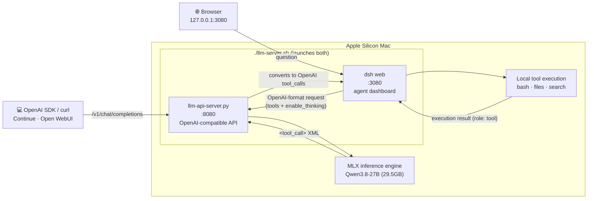

# Local LLM Server (MLX)

[한국어](README.ko.md) | **English**

> **Apple Silicon Mac only** (M1/M2/M3/M4/M5)
> MLX is Apple's native ML framework and only runs on Apple Silicon.
> NVIDIA GPU / Intel Mac / Windows / Linux are not supported.

A project that runs local LLMs as an OpenAI-compatible API server on Apple Silicon Macs.
Connect any OpenAI SDK-compatible client as-is and run inference fully locally.
Tool calling (function calling) is supported, so agent harnesses like dsh can attach too —
a single `./llm-server.sh` launches both the API server (:8080) and the dsh agent dashboard (:3080).

---

## Supported Models

| Model | Launch command | Memory | Speed | Notes |
|------|----------|------:|-----:|------|
| **Qwen3.8-27B-8bit** (default) | `./llm-server.sh` | ~30GB (peak 34GB) | ~25 tok/s³ | Multimodal (images), Thinking OFF by default with per-request ON, preserve_thinking support, mlx-vlm runtime |
| **Qwen3.8-27B Uncensored-8bit** (orcarouter, abliterated) | `./llm-server.sh qwen38-uncensored` | ~28GB (peak ~36GB) | ~28 tok/s⁶ | Abliterated uncensored — identical architecture to the default: multimodal, tool calling, Thinking control, MTP all preserved. `uncensored` alias works too |
| **Qwen3.6-27B-6bit** (previous default) | `./llm-server.sh qwen36` | ~23GB | ~12 tok/s³ ⁵ | Same features as above — for 32–48GB machines |
| **Qwen3.6-35B-A3B-8bit** (fast profile) | `./llm-server.sh qwen36-fast` | ~37GB | 3–4x⁴ | Multimodal MoE (3B active). For bulk/repetitive work — the 27B dense is higher quality |
| **SuperGemma4-26B uncensored-v2** | `./llm-server.sh supergemma4` | ~13GB | 46 tok/s | Uncensored (fine-tuned), stronger tool calls / Korean / code, text only |
| **SuperGemma4-26B abliterated-multimodal** | `./llm-server.sh supergemma4-vlm`¹ | ~15GB | ~49 tok/s | Uncensored (EGA), image + text input |

Loading two models at once is not possible (exceeds memory). Switch by restarting the server.

> ¹ `supergemma4` runs the text-only uncensored-v2 (the `supergemma4-text` alias is identical). Run the multimodal variant with the `supergemma4-vlm` profile or `python llm-api-server.py --model Jiunsong/supergemma4-26b-abliterated-multimodal-mlx-4bit`.

> ³ Measured on an M5 Pro 64GB. Qwen3.8-8bit: 25.2 tok/s with MTP ON (drafter `mlx-community/Qwen3.8-27B-MTP-8bit`, block_size=6) vs 9.6 tok/s with `--no-mtp` — **2.64x**, measured 2026-08-23 (warm, non-streaming, thinking OFF, temp=0). Qwen3.6-6bit measured 2026-08-02.

> ⁵ Qwen3.6-27B runs with **MTP OFF**: the drafter is trained for Qwen3.8-27B, so `llm-server.sh` disables it automatically on non-Qwen3.8 profiles. This row is an un-accelerated measurement.

> ⁶ Measured 2026-08-23 on an M5 Pro 64GB: 9.37 → **28.56 tok/s (3.05x)** on code, 9.80 → 16.36 (1.67x) on Korean prose. The drafter is trained on stock Qwen3.8-27B, but abliteration costs only ~3-6% of the stock model's speedup — acceptance holds. Peak memory is ~2GB higher than the default model, so 48GB machines are tight.

> ⁴ Relative speed vs the 27B dense (public benchmarks, not measured in this project). In Qwen's official benchmarks the 27B dense beats the 35B-A3B across the board, with a +15.5 point gap on SkillsBench (coding agents) — so the 27B stays the default.

### Feature Support by Model

| Feature | Qwen3.8-27B (default) / Qwen3.6-27B | SuperGemma4 uncensored-v2 | SuperGemma4 abliterated-multimodal |
|------|:-----------------:|:------------------------:|:---------------------------------:|
| Context profiles (1m/262k) | ✅ | ❌ (fixed 128K) | ❌ (fixed 256K) |
| Thinking mode (`enable_thinking`) | ✅ (OFF by default) | ❌ | ❌ |
| Tool calling (`tools`) | ✅ (verified on Qwen3.8) | untested | untested |
| Interactive chat (`llm-chat.sh`) | ✅ | ❌ | ❌ |
| Image input (multimodal) | ✅ | ❌ | ✅ |
| Video input | ❌ | ❌ | ❌ |

### Qwen3.6 → Qwen3.8 Switch (2026-08-18, current)

| Item | Qwen3.6-27B-6bit *(previous default)* | Qwen3.8-27B-8bit *(current default)* |
|------|:------------------------------:|:------------------------------:|
| **Architecture** | Dense 27B (`qwen3_5`) | Dense 27B (`qwen3_5`) — **identical, only the model ID changed** |
| **Quantization** | 6bit (~22.8GB) | 8bit (~29.5GB) — no 6bit conversion exists for 3.8 |
| **Measured memory** | ~23GB | peak ~34GB |
| **Measured speed** | ~12 tok/s (MTP OFF — drafter is 3.8-only) | **~25 tok/s** (MTP ON) / 9.6 (`--no-mtp`) |
| **Context** | 262K / 1M (YaRN) | 262K / 1M (same YaRN settings applied; 1M not yet measured on 3.8) |
| **Tool calling** | untested | ✅ verified end-to-end (including dsh E2E) |
| **Thinking** | ✅ | ✅ (had a silent no-op bug right after the switch → fixed 2026-08-18) |
| **Runtime** | mlx-vlm 0.6.12 | mlx-vlm 0.6.13 (includes Qwen3.5-family decode fixes) |

bf16 (54GB) is impractical on a 64GB Mac due to the wired memory limit, so 8bit was chosen.
The architecture is identical, so the switch required no code changes — a trade of a little speed for next-generation quality.

### Qwen3.5 → Qwen3.6 Switch and 3-Model Comparison (history)

> Below is the record of the earlier Qwen3.5 → 3.6 switch.

| Item | Qwen3.5-35B-A3B *(previous)* | Qwen3.6-27B-6bit *(then default)* | SuperGemma4-26B uncensored-v2 |
|------|:------------------------:|:------------------------------:|:-----------------------------:|
| **Architecture** | MoE 35B (A3B active) | **Dense 27B** | MoE 26B |
| **Runtime** | `mlx-lm` | `mlx-vlm` | `mlx-lm` |
| **Memory** | ~20GB | ~23GB | ~13GB |
| **Generation speed** | ~103 tok/s | ~12 tok/s³ | ~46 tok/s |
| **Context** | 262K / 1M (YaRN) | 262K / 1M (YaRN) | fixed 128K |
| **Image input** | ❌ | ✅ | ❌ |
| **Thinking mode** | ✅ | ✅ **(OFF by default)** | ❌ |
| **Uncensored** | ❌ | ❌ | ✅ (fine-tuned) |
| **Korean/coding boost** | baseline | baseline | ✅ (fine-tuned) |
| **Tool-call boost** | baseline | baseline | ✅ (2x↑) |
| **Interactive chat** | ✅ | ✅ | ❌ |
| **MMLU-Pro** | - | **86.2** | 82.6 |
| **SWE-bench Verified** | - | **77.2** | - |
| **GPQA Diamond** | - | **87.8** | 82.3 |

Qwen3.6 has fewer parameters but moved to a dense architecture, added multimodal input, and ships with Thinking OFF by default (per-request ON). It's slower than the MoE 3.5, but image and Thinking support are the key differences.

---

## Requirements

| Item | Minimum | Recommended |
|------|------|------|
| Mac | Apple Silicon (M1+) | M3 Pro / M4 Pro or newer |
| Memory | 24GB (light models) | 48–64GB |
| Python | 3.10+ | 3.11+ |
| Disk | 20GB free | 50GB+ |

**Memory requirements vary by use case** — beyond the model weights you also need KV cache, the vision encoder, and Metal scratch buffers:

| Memory | Realistic usage |
|--------|--------------|
| 24GB | Light models only (SuperGemma4 etc.). A 27B model may load but risks swap/OOM — short-context experiments only |
| 32GB | Realistic minimum for Qwen3.6-27B-6bit with short prompts |
| 48GB | Qwen3.8-27B-8bit usable (measured peak 34GB) |
| 64GB | Recommended for multimodal + long context. 262K is practical |

> The 1M context is the model/YaRN configuration ceiling — it does not mean you can practically "fill 1M" on any memory configuration.

---

## Installation

```bash
git clone https://github.com/LeeKiYoung/local-llm.git
cd local-llm
./setup.sh
```

`setup.sh` automatically:
1. Checks Apple Silicon / Python / memory
2. Shows a model selection menu matched to your memory
3. Creates a virtualenv + installs **mlx-vlm==0.6.13 / mlx==0.32.0** (Qwen MTP/KV cache/MRoPE fixes, APC included) + FastAPI + uvicorn
4. Downloads the chosen model and wires it into the scripts

| # | Model | Memory | Notes |
|:-:|------|------:|------|
| 1 | **Qwen3.8-27B-8bit** ⭐ | ~30GB | VLM, text+image, Thinking OFF by default (48GB+ recommended) |
| 2 | **Qwen3.6-27B-6bit** | ~23GB | VLM (previous default, for 32–48GB machines) |
| 3 | **SuperGemma4-26B** (uncensored) | ~16GB | Uncensored secondary model (text only) |
| 4 | Custom | - | Any Hugging Face model ID |

An automatic recommendation is shown based on your memory. Just press Enter to install the recommended model (Qwen3.8-27B-8bit).

### Environment Only (model later)

```bash
./setup.sh --no-model
```

### Where are models stored?

The model is downloaded automatically on first run to the default path:

```
~/.cache/huggingface/hub/models--mlx-community--Qwen3.8-27B-8bit/    (~29.5GB)
```

To change the location (e.g. external SSD):

```bash
# Add to ~/.zshrc
export HF_HOME=/Volumes/MySSD/.huggingface

source ~/.zshrc && ./setup.sh
```

---

## Project Structure

```
local-llm/
├── setup.sh                              # Automated setup (env + model + deps)
├── llm-chat.sh                           # Interactive chat
├── llm-server.sh                         # API server launcher
├── llm-api-server.py                     # FastAPI custom API server (core)
├── llm-proxy.py                          # Transparent logging proxy (optional)
├── profiles/
│   ├── config-qwen36-27b-262k.json       # Default profile (262K, Qwen3.6-27B)
│   └── config-qwen36-27b-1m.json         # Extended profile (1M YaRN, Qwen3.6-27B)
├── tests/
│   ├── test_api_server.py                # API server tests
│   ├── test_tool_calling.py              # tool calling / thinking tests
│   ├── test_stats.py                     # dashboard aggregation tests
│   └── test_proxy.py                     # proxy tests (108 total)
├── local-llm-guide-2026.md               # Model comparison guide
├── .venv/                                # Python virtualenv
└── logs/                                 # Request/response JSONL logs (auto-created)
```

---

## Quick Start

### Step 1: Setup

```bash
git clone https://github.com/LeeKiYoung/local-llm.git
cd local-llm
./setup.sh
```

### Step 2: Start the server

```bash
# Qwen3.8-27B (default) — runs API server + dsh dashboard together
./llm-server.sh

# 1M context mode
./llm-server.sh 1m

# Qwen3.6-35B-A3B (MoE, fast profile)
./llm-server.sh qwen36-fast

# SuperGemma4
./llm-server.sh supergemma4
```

### Step 3: Send a request

```bash
curl http://localhost:8080/v1/chat/completions \
  -H "Content-Type: application/json" \
  -d '{
    "messages": [{"role": "user", "content": "Hello!"}],
    "max_tokens": 200
  }'
```

---

## Usage Guide

### 1. Interactive Chat

```bash
./llm-chat.sh           # 262K
./llm-chat.sh 1m        # 1M context
./llm-chat.sh 262k      # explicit 262K
```

Extra options:

```bash
./llm-chat.sh 1m --temp 0.3
./llm-chat.sh --max-tokens 4000
./llm-chat.sh --system-prompt "Answer in English only"
```

Example session:

```
✅ 1M context (YaRN) applied

🚀 Chat started (exit: Ctrl+C)

>> Write a Fibonacci function in Python
def fibonacci(n):
    a, b = 0, 1
    for _ in range(n):
        a, b = b, a + b
    return a
```

### 2. API Server

OpenAI-compatible API server. FastAPI + the mlx_vlm Python API for direct inference.
Reachable from other devices on the same network (e.g. a Mac mini).

```bash
# Qwen3.8-27B (default)
./llm-server.sh              # 262K context, Thinking OFF, MTP ON, dsh dashboard auto-launch
./llm-server.sh 1m           # 1M context (YaRN)
./llm-server.sh 262k 9090    # custom port
./llm-server.sh --think      # Thinking ON by default
./llm-server.sh --no-mtp     # disable MTP speculative decoding
./llm-server.sh --no-apc     # disable APC prefix caching
./llm-server.sh --no-dsh     # API server only, no dsh dashboard

# Qwen3.8-27B Uncensored (orcarouter abliterated, same arch as default)
./llm-server.sh qwen38-uncensored    # ~28GB auto-download on first run (uncensored alias works too)

# Qwen3.6-27B (previous default, for 32–48GB machines)
./llm-server.sh qwen36

# Qwen3.6-35B-A3B (MoE, fast profile)
./llm-server.sh qwen36-fast          # ~37GB auto-download on first run

# SuperGemma4
./llm-server.sh supergemma4          # ~16GB auto-download on first run
./llm-server.sh supergemma4 9090     # custom port
```

On launch:

```
🌐 API server started
   Local:     http://localhost:8080
   Network:   http://<YOUR_LOCAL_IP>:8080
   Dashboard: http://localhost:8080/dashboard

   Endpoint: /v1/chat/completions
   Streaming: stream=true supported
```

#### Basic call

```bash
curl http://localhost:8080/v1/chat/completions \
  -H "Content-Type: application/json" \
  -d '{
    "messages": [{"role": "user", "content": "Hello!"}],
    "max_tokens": 200
  }'
```

#### Streaming

```bash
curl http://localhost:8080/v1/chat/completions \
  -H "Content-Type: application/json" \
  -d '{
    "messages": [{"role": "user", "content": "Hello!"}],
    "stream": true,
    "max_tokens": 200
  }'
```

#### Requests with images (multimodal)

```bash
# Image request (base64)
curl http://localhost:8080/v1/chat/completions \
  -H "Content-Type: application/json" \
  -d '{
    "messages": [{"role": "user", "content": [
      {"type": "text", "text": "Describe this image"},
      {"type": "image_url", "image_url": {"url": "data:image/jpeg;base64,..."}}
    ]}],
    "max_tokens": 500
  }'
```

> Remote `http(s)` image_url is disabled by default (SSRF prevention) — only `data:image/...;base64` is allowed.
> If you need remote URLs, run the server with `--allow-remote-images`.

#### Per-request Thinking control

```bash
# Enable Thinking (OFF by default → ON for this request only)
curl http://localhost:8080/v1/chat/completions \
  -d '{"messages":[{"role":"user","content":"123*456=?"}],"enable_thinking":true,"preserve_thinking":true,"max_tokens":500}'
```

#### Supported parameters (OpenAI compatible)

| Parameter | Type | Default | Description |
|---------|------|--------|------|
| `model` | string | server model | model ID |
| `messages` | array | required | conversation messages |
| `stream` | bool | false | SSE streaming |
| `temperature` | float | 1.0 | sampling temperature |
| `top_p` | float | 1.0 | nucleus sampling |
| `max_tokens` | int | 2048 | max generated tokens |
| `max_completion_tokens` | int | - | alias for max_tokens |
| `stop` | string/array | null | stop sequences (not applied yet) |
| `seed` | int | null | deterministic sampling (OpenAI compat; not passed to the model) |
| `presence_penalty` | float | 0 | presence penalty (OpenAI compat; not passed to the model) |
| `frequency_penalty` | float | 0 | frequency penalty (OpenAI compat; not passed to the model) |
| `repetition_penalty` | float | null | repetition penalty (parsed; not currently passed to the model) |
| `enable_thinking` | bool | false | Thinking mode (OFF by default, per-request ON; Qwen3.8/3.6) |
| `preserve_thinking` | bool | false | true keeps the thinking text; false returns only the answer after `</think>` |
| `tools` | array | null | OpenAI function calling schema — passed into the chat template |
| `tool_choice` | string | null | `"none"` ignores tools (other values unsupported) |

#### Tool Calling (Function Calling)

OpenAI-compatible tool calling is supported (2026-08-18, including streaming). When the model
calls a function, the response comes back with `finish_reason: "tool_calls"` and OpenAI-format
`tool_calls` (`arguments` is a JSON string). In streaming mode, content output stops when a
`<tool_call>` is detected and a single tool_calls delta chunk is emitted at the end of the stream.

```bash
curl http://localhost:8080/v1/chat/completions \
  -d '{"messages":[{"role":"user","content":"What is the weather in Seoul?"}],
       "tools":[{"type":"function","function":{"name":"get_weather",
         "parameters":{"type":"object","properties":{"city":{"type":"string"}},"required":["city"]}}}]}'
# → {"finish_reason":"tool_calls","message":{"tool_calls":[{"function":{"name":"get_weather","arguments":"{\"city\": \"Seoul\"}"}}]}}
```

Return tool results the standard OpenAI way (`role: "tool"` + `tool_call_id`).
Note: the Qwen3.8 chat template uses an XML-style tool call format
(`<function=...><parameter=...>`), which the server converts to the OpenAI format.

### Two ways to use it: direct API calls vs the dsh dashboard

This server can be used in two ways:

1. **Direct API calls** — OpenAI SDK-compatible clients (curl, Python SDK, Continue, etc.)
   call `http://localhost:8080/v1` directly. All the examples above use this mode.
2. **dsh agent dashboard** — a web UI where you type a question in the browser and an agent
   completes the task on its own using tools (bash, file read/write, etc.).



**Flow** (asking the dsh dashboard "count the lines in server.log"):

1. Browser → dsh converts the question to OpenAI format and sends it to `:8080` (with the tools schema)
2. The server injects tools into the Qwen chat template and runs inference → the model calls a function via `<tool_call>` XML
3. The server converts the XML to OpenAI `tool_calls` format and responds (`finish_reason: "tool_calls"`)
4. dsh actually executes the tool locally (bash etc.) → sends the result back as a `role: "tool"` message
5. Steps 2–4 repeat as needed until the model produces a final answer → shown in the browser

Every step runs locally; there are no external API calls.

#### Getting connected

```bash
./llm-server.sh          # API server (:8080) + dsh dashboard (:3080) together
./llm-server.sh 1m       # 1M context (dsh auto-launches the same way)
./llm-server.sh --no-dsh # API server only
```

- **Dashboard**: click http://127.0.0.1:3080 from the server banner → type directly into the prompt box
- **API**: `http://localhost:8080/v1` (or `http://<LOCAL_IP>:8080/v1` on the same network)
- Stopping the server with Ctrl+C also shuts down the dsh dashboard

#### dsh configuration (`~/.dsh/settings.yaml`)

Install dsh via `setup.sh` or `npm install -g @deepseek-ai/dsh`.
Local server connection settings:

```yaml
llm-pi-ai:
  providers:
    local-mlx:
      displayName: Local MLX
      apiKeyEnv: LOCAL_LLM_API_KEY   # the local server has no auth — any dummy value works
      api: openai-completions
      baseURL: http://localhost:8080/v1
      defaultInput: [text, image]
      defaultContextWindow: 262144
      defaultMaxTokens: 8192
      models:
        - id: mlx-community/Qwen3.8-27B-8bit
          name: Qwen3.8 27B (local MLX)
          # thinking control: pi-ai's qwen dialect sends top-level enable_thinking
          compat:
            thinkingFormat: qwen
          reasoningEfforts:
            off:
            high: high

agent-default-model:
  provider: local-mlx
  model: mlx-community/Qwen3.8-27B-8bit
  reasoningEffort: off   # off = no thinking (fast), high = thinking ON (slower but more accurate)
```

With thinking ON (`reasoningEffort: high`), the server buffers until `</think>` and streams only
the answer, so the first token appears delayed by the thinking time (it's not stuck).
Note: pi-ai sends a `developer` role for reasoning models; the server automatically maps it to `system`.

One-shot runs from the terminal (instead of the web UI) also work:

```bash
LOCAL_LLM_API_KEY=local dsh --profile headless "How many files are in the current directory?"
```

#### Web UI integration

Connect Continue, Open WebUI, etc. as an OpenAI endpoint:
- URL: `http://<YOUR_LOCAL_IP>:8080/v1`
- API Key: any value (no auth)

#### Access from outside the network (Tailscale)

```bash
brew install tailscale
# After logging into Tailscale on both devices
curl http://<TAILSCALE_IP>:8080/v1/chat/completions ...
```

#### Architecture

```
Client (:8080) → FastAPI server (direct mlx_vlm API calls)
```

- `asyncio.Semaphore(1)` — sequential GPU processing, concurrent HTTP intake
- Returns 429 when the wait queue exceeds 5 (OOM protection)
- **MTP speculative decoding** — separate 0.48GB drafter for Qwen3.8-27B, ON by default, 2.64x measured (see section below)
- **Prompt KV cache reuse** — skips the common prefix in multi-turn conversations, shortening TTFT from the second turn (`PromptCacheState`)
- **Vision encoder cache** — resending the same image skips the vision encoder, saving ~1–2s (`VisionFeatureCache`)
- **Prefill chunking** — long prompts are split into 512-token chunks for better Metal kernel efficiency (`prefill_step_size`)
- Metal GPU scratch buffers are released after each request (`mx.clear_cache()`); KV cache arrays are kept after eval

### 3. Logging

Logging is **built into** the server. Both models log identically.

```
logs/
├── 2026-04-15.jsonl
└── 2026-04-16.jsonl
```

| Field | Contents |
|------|------|
| timestamp | request time |
| ip | caller's IP |
| duration_ms | response time (ms) |
| enable_thinking | Thinking ON/OFF |
| stream | streaming or not |
| prompt_preview | prompt preview (200 chars) |
| content_preview | response preview (200 chars) |
| usage | token usage (prompt / completion / total) |

```bash
# View today's log
cat logs/$(date +%Y-%m-%d).jsonl | python3 -m json.tool

# Request count per IP
cat logs/*.jsonl | jq -r '.ip' | sort | uniq -c | sort -rn

# Find slow requests (over 3 seconds)
cat logs/*.jsonl | jq 'select(.duration_ms > 3000)'
```

#### Web dashboard

While the server is running, the logs above are visualized at **http://localhost:8080/dashboard**.
It's built into the server, so it works without a separate process, Docker, or Grafana, and uses
no external CDN — it renders fully offline. It goes down together with the server.

| Panel | Contents |
|------|------|
| Summary cards | total requests, total tokens, avg tokens/s, p50 / p90 response time |
| Requests per day | request count by date |
| Tokens per day | prompt vs completion tokens |
| Response time percentiles | p50 / p90 / p99 / max |
| Ratios | Thinking ON/OFF, Streaming ON/OFF, finish reason (stop/length) |
| Recent requests | last 50 (time, IP, response time, tokens, prompt) |

The toolbar lets you pick the range (1/7/30 days) and the **auto-refresh interval (off/5s/10s/30s, default 10s)**.
Auto-refresh swaps only the `/api/stats` result without reloading the page, and pauses polling
while the tab is hidden, refreshing once immediately when you return.

Aggregated data is also available directly via `GET /api/stats`.

```bash
# Default: 7 days
curl -s localhost:8080/api/stats | jq

# Custom range (1–30 days, auto-clamped if out of range)
curl -s "localhost:8080/api/stats?days=30" | jq '.duration_ms'
```

> `days` counts **date files, not rolling 24-hour windows**. `days=1` reads only today's
> `logs/YYYY-MM-DD.jsonl`, so right after midnight last night's requests won't appear.
> Use `days=2` or more to cover that window.

---

## Context Profile System

> Supported on Qwen3.8/3.6-27B. SuperGemma4 is fixed at 128K/256K and this system does not apply.
> The 1M YaRN settings validated on Qwen3.6 are applied as-is to 3.8 (1M not yet measured on 3.8).

Two profiles: 262K (default) and 1M (extended). Switched by swapping `config.json`.

```bash
# Switch in chat
./llm-chat.sh 1m       # switch to 1M, then start chat
./llm-chat.sh 262k     # switch to 262K, then start chat

# Switch on the API server
./llm-server.sh 1m     # switch to 1M, then start server
./llm-server.sh 262k   # switch to 262K, then start server
```

| Profile | Context | Memory | Use case |
|-------|-------:|------:|------|
| 262K (default) | ~520K chars | ~22–25GB | general chat, coding |
| 1M (YaRN) | ~2M chars | ~34GB | large document / codebase analysis |

- **Restart required** after switching (Ctrl+C → relaunch)
- 1M mode may slightly degrade quality on short prompts (a property of static YaRN)
- 262K is enough for everyday use. Only use 1M for genuinely long documents

### How it works

YaRN (Yet another RoPE extensioN) scales the positional encoding.

| Setting | 262K | 1M |
|------|------|-----|
| rope_type | `"default"` | `"yarn"` |
| factor | (none) | `4.0` |
| original_max_position_embeddings | (none) | `262144` |

---

## MTP Speculative Decoding

> Qwen3.8-27B only. Requires a **separate drafter checkpoint** — see the note below.

### Overview

MTP (Multi-Token Prediction) is a speculative decoding technique: a small draft head proposes several token candidates at once, the 27B target verifies them in a single forward pass, and every accepted token is committed in that one step.

**The drafter must be passed explicitly.** `mlx-community/Qwen3.8-27B-8bit` declares `mtp_num_hidden_layers: 1` in its config, but its checkpoint contains **no MTP tensors** (0 matches in `model.safetensors.index.json`) — so there is no usable embedded head. `generate_step()` also needs `draft_model=` on top of `draft_kind`/`draft_block_size`; passing only the latter two leaves speculative decoding **silently inactive**. This project shipped in exactly that state until 2026-08-23, which is why the old measurement read ~9.8 tok/s.

- **Drafter** — `mlx-community/Qwen3.8-27B-MTP-8bit`, **0.48GB**, `model_type: qwen3_5_mtp`, auto-downloaded on first run. No extra Python packages
- **Measured** — 9.6 → **25.2 tok/s (2.64x)** on an M5 Pro 64GB. Gains are largest on code (drafter acceptance is highest there) and smallest on prose
- **Same model, same quality** — the 27B still produces every token that ships; the drafter only proposes. Code and reasoning outputs came back **byte-identical** to `--no-mtp`. Long-form prose can differ at a near-tie position (the same two candidates swap between runs), so treat output as *same distribution*, not bit-reproducible — response caching and reproducible eval runs cannot assume determinism
- **Multimodal preserved** — image requests work and are accelerated too (the drafter config carries a `vision_config`)

### Default: ON

```
🚀 MTP: ON (mtp, block_size=6)
   드래프터: mlx-community/Qwen3.8-27B-MTP-8bit
```

Auto-enabled at server start; the drafter loads on the same thread as the model. If the drafter fails to load, the server logs a warning and continues with MTP off. Override the checkpoint with `--draft-model`. `block_size=6` measured faster than 3 (27.7 vs 22.5 tok/s), so the default stays 6.

Non-Qwen3.8 profiles (`qwen36`, `qwen36-fast`, `supergemma4*`) disable the drafter automatically and say so on startup.

### Disable

```bash
./llm-server.sh --no-mtp
```

Only for comparison or when MTP is not needed.

### Requirements

- mlx-vlm pinned at **0.6.13** (includes Qwen MTP prefill, quantized KV cache, and MRoPE position fixes)
- Installed automatically by `setup.sh`: `pip install mlx-vlm==0.6.13 mlx==0.32.0`
- With an older version, the server auto-detects it at startup and falls back gracefully (prints an MTP-disabled warning)

---

## APC (Prefix Caching)

> Automatic Prefix Caching from mlx-vlm 0.6.5+. ON by default.

### Overview

APC **reuses KV blocks of common prefixes across requests**, skipping the prefill. For agent
clients like dsh that attach the same system prompt to every request, TTFT (time to first token)
goes down.

- **No effect on output quality** — it only reuses already-computed KV; sampling is untouched
- **Per-model isolation** — the disk cache namespace is derived from the model_id, so `qwen36` / `qwen36-fast`
  never reuse each other's KV blocks even if they share a directory
- **Runs alongside** the existing `PromptCacheState` (reuses the previous turn's KV) and `VisionFeatureCache` (avoids re-encoding images)

### ⚠️ Measured results on Qwen3.6-27B (2026-08-02, M5 Pro 64GB)

**No APC benefit was observed on this model.** The default stays ON, but **memory-only**.

- Qwen3.6-27B has a hybrid architecture (`linear_attention` + `full_attention`), so the recurrent
  state cannot be reconstructed by concatenating K/V blocks. `model_apc_mode()` selects
  **`"exact"` (full-prompt snapshot)** mode rather than `"block"`.
- In an experiment that evicted the previous cache and re-requested the same prefix: **0 hits**
  (A 4.83s → C 4.57s, effectively cold). It only consumed 1.4GB of disk.
- `dispatch.py` only consults APC when `reused_prefix_len == 0`. That means if `PromptCacheState`
  catches even a **trivial few-token match**, the APC lookup is skipped entirely.

The perceived speedup (TTFT 12.27s → 0.44s) comes from the existing **`PromptCacheState`**, not APC.
Sequential conversation patterns like dsh are already covered by that path.

APC could become meaningful with a model that supports block mode (non-hybrid).

### Default: ON (memory-only)

```
♻️  APC: ON (prefix caching, memory-only)
```

### Disable / persist to disk

```bash
./llm-server.sh --no-apc                             # turn off
python llm-api-server.py --apc-dir .apc-cache        # enable disk persistence
python llm-api-server.py --apc-max-gb 50             # change disk cap (0 = unlimited)
```

`llm-server.sh` does not pass `--apc-dir` (= memory-only). If you need disk persistence,
run `llm-api-server.py` directly.

### Known limitation

Requests containing images disable `prompt_cache_state` (a Metal KV consistency guard).
APC itself understands multimodal prefixes, but this guard remains in place.

---

## Thinking Mode

> Supported on Qwen3.8/3.6-27B. Sending `enable_thinking` to SuperGemma4 causes no error but is ignored. The server auto-detects and handles this.

Thinking is OFF by default (DEFAULT_THINKING=False). Turn it ON per request with enable_thinking=true. With `preserve_thinking=true`, the thinking text is included in the response. The default (false) strips the thinking block and returns only the final answer.

> ⚠️ Fixed 2026-08-18: a bug where enable_thinking was silently ignored after the Qwen3.8 switch
> (nested `chat_template_kwargs` passing was ignored by the template) was fixed by passing it as a top-level kwarg.

> **How it works**: the Qwen chat template auto-injects the `<think>` opening tag as a prompt prefix. So the model's generated text only contains the closing `</think>` tag, never a complete `<think>...</think>` pair. With `preserve_thinking=false` (default), the server strips everything up to `</think>` and returns only the answer text. In streaming (`stream=true`) it behaves the same: chunks are buffered until `</think>` appears, and only subsequent chunks are delivered to the client.

### Thinking ON

```
>> What is 123 * 456?
<think>Let me compute 123 × 456.
123 × 400 = 49,200
123 × 56 = 6,888
49,200 + 6,888 = 56,088</think>

123 × 456 = 56,088.
```

### Control by mode

| Mode | Method | Works |
|------|------|:---:|
| `llm-chat.sh` (interactive) | add `/no_think` to the prompt | O |
| `llm-server.sh` (API) | Thinking OFF by default | O |
| `llm-server.sh --think` (API) | server default becomes Thinking ON | O |
| API request `enable_thinking` | **per-request control** | **O** |
| API request `preserve_thinking` | **include the thinking block or not** | **O** |

### When to turn it on or off?

| Situation | Thinking | Reason |
|------|:-------:|------|
| Math/logic | **ON** | major accuracy boost |
| Coding | **ON** | step-by-step reasoning reduces bugs |
| Simple questions | OFF | faster responses |
| Translation/summarization | OFF | no reasoning needed |
| Creative writing | OFF | more natural flow |

- Thinking tokens count against `max_tokens` → with Thinking ON, 8000+ is recommended

---

## Parameter Guide

### Temperature

| Value | Effect | Use case |
|---|------|------|
| 0.0 | deterministic (always the same answer) | coding, math |
| 0.3 | slight variation | general chat |
| 0.7 | creative | writing, brainstorming |
| 1.0+ | very random | experiments |

> **⚠️ Behavior change (2026-08-02)**
> Previous versions passed the value to mlx-vlm under the wrong argument name `temp=`, so **the
> client's temperature was ignored and everything ran at 0.0 (greedy)**. It is now applied correctly.
> When unspecified, the OpenAI default of **1.0** applies, so if you want the old deterministic
> output, explicitly set `"temperature": 0.0` in the request.
>
> Verified on Qwen3.6-27B: `0.0` → `"Purple elephants dance on moonlight."`,
> `2.0` → degenerate output (token repetition). Confirms temperature reaches the sampler.

### Supported sampling parameters

| Parameter | Passed through | Notes |
|---|:-:|---|
| `temperature` | ✅ | default 1.0 |
| `top_p` | ✅ | default 1.0 |
| `seed` | ✅ | **auto-generated per request when unspecified** (see below) |
| `repetition_penalty` | ✅ | None when unspecified |
| `presence_penalty` | ✅ | converted to None when 0 |
| `frequency_penalty` | ✅ | converted to None when 0 |
| `stop` | ❌ | parsed but not passed — mlx-vlm handles `eos_tokens` only in `generate()`, not `stream_generate()`, so streaming/non-streaming would diverge |

### Automatic seed generation — working around a worker-thread RNG issue

**Symptom.** Repeating the same request with `temperature > 0` returned **exactly the same
response every time**. Changing the temperature changed the output, so sampling itself worked —
only run-to-run variation was missing.

**Cause.** Because MLX streams are thread-local, this server runs model loading and all inference
on a dedicated worker thread (`_gpu_executor`). But MLX's global RNG (`mx.random.state`) array is
bound to the main thread's stream, so accessing it from the worker thread fails:

```
RuntimeError: There is no Stream(gpu, 0) in current thread.
```

As a result the global RNG state **never advances**, drawing the same random numbers on every request.

**Fix.** When the client doesn't specify a `seed` and `temperature > 0`, the server generates a
seed per request. When a seed is present, mlx-vlm uses a sampler that keys off **seed + token
position** instead of the global RNG, sidestepping the worker-thread issue.

- No `seed` → different response per request (same as OpenAI's default behavior)
- `seed` specified → fully reproducible

**Measured (Qwen3.6-27B, `temp=1.0 top_p=1.0`, same prompt 6 times)**

| | Unique responses |
|---|---|
| Before fix | **1 / 6** |
| After fix | **6 / 6** |
| `seed=42` fixed, 3 runs | 1 / 3 (reproducibility intact) |

> Unrelated to MTP ON/OFF (reproduced and fix-verified in both).

### Max Tokens

| Use case | Recommended |
|------|------:|
| Short answers | 200 |
| General chat | 500 |
| Code generation | 1000–2000 |
| Long documents | 4000+ |
| Thinking ON | 8000+ |

---

## SuperGemma4 Lineup Details

All SuperGemma4 variants published by Jiunsong. Pick by runtime and use case.

| Model | Params | Format | Runtime | Size | Multimodal | Uncensoring method |
|------|:-------:|------|--------|-----:|:-------:|:------------:|
| `uncensored-mlx-4bit-v2` | 26B MoE | MLX 4bit | `mlx_lm` | ~13GB | ❌ | Uncensored (fine-tuned), default |
| `abliterated-multimodal-mlx-4bit` | 26B MoE | MLX 4bit | `mlx_vlm` | ~15GB | ✅ | Abliterated+EGA, 2.2K downloads |
| `abliterated-multimodal-mlx-8bit` | 26B MoE | MLX 8bit | `mlx_vlm` | ~24GB | ✅ | Same as above, higher quality |
| `uncensored-gguf-v2` (Ollama) | 26B MoE | GGUF Q4_K_M | llama.cpp / Ollama | ~17GB | ❌ | Uncensored (fine-tuned), 42K+ downloads |
| `SuperGemma4-31b-abliterated-mlx-4bit` | 31B **Dense** | MLX 4bit | `mlx_lm` | ~17.3GB | ❌ | Abliterated, slow |
| `SuperGemma4-31b-abliterated-GGUF` | 31B **Dense** | GGUF Q4_K_M | llama.cpp / Ollama | ~18.7GB | ❌ | Abliterated, slow |

### 26B variant comparison (MLX)

Same 26B family, but different purposes.

| Item | `uncensored-mlx-4bit-v2` | `abliterated-multimodal-mlx-4bit` |
|------|:------------------------:|:---------------------------------:|
| **Uncensoring method** | Uncensored (fine-tuned) | Abliterated (weight vector removal) |
| **Multimodal** | ❌ text only | ✅ image + text |
| **Server library** | `mlx_lm` | `mlx_vlm` (v0.4.3+, day-0 support) |
| **Disk size** | ~13GB | ~15GB |
| **Generation speed** | 46.2 tok/s | ~49.5 tok/s |
| **Korean/code boost** | ✅ improved via fine-tuning | baseline |
| **HF downloads** | ~8,908 | ~2,230 |

> **Difference between uncensoring methods**
> - **Uncensored**: retrained on data to answer directly without refusals → code and Korean performance improve too
> - **Abliterated**: surgically removes the model's internal "refusal" direction vector → uncensored without extra training, no capability gains
>   - Due to Gemma 4 26B's MoE structure, standard abliteration leaves a 29% refusal rate → **EGA (Expert-Granular Abliteration)** applies it per expert, reducing it to 0.7%

### uncensored-v2 Quick Bench performance (vs Gemma 4 26B IT)

| Category | Gemma 4 26B IT | SuperGemma4 uncensored-v2 | Gain |
|---------|:--------------:|:-------------------------:|:----:|
| Code | 92.3 | 98.6 | +6.3 |
| Logic/reasoning | 86.9 | 95.2 | +8.3 |
| Korean | 90.7 | 95.0 | +4.3 |
| **Overall** | **91.4** | **95.8** | **+4.4** |

v2 improvements over v1: tool-call routing bug fix, +8.7% generation speed (46.2 tok/s), neutralized chat template.

### The 31B models

5B more parameters than the 26B. Text-only, abliterated.

| Item | MLX 4bit | GGUF Q4_K_M |
|------|:--------:|:-----------:|
| **Runtime** | `mlx_lm` (Apple Silicon) | llama.cpp / Ollama |
| **Size** | ~17.3GB | ~18.7GB |
| **Generation speed (reference)** | not measured on MLX (~30 tok/s on RTX 3090) | - |
| **Multimodal** | ❌ | ❌ |
| **HF downloads** | ~1,302 | - |
| **HF** | [link](https://huggingface.co/Jiunsong/SuperGemma4-31b-abliterated-mlx-4bit) | [link](https://huggingface.co/Jiunsong/SuperGemma4-31b-abliterated-GGUF) |

> Unlike the 26B uncensored-v2, the 31B is abliterated-only with no fine-tuning — so no code/Korean improvements. Being dense, it generates slower than the 26B MoE. The point is base-capability gains from the raw parameter increase.

**Bottom line**
- Need image handling → `abliterated-multimodal` (26B MLX, `mlx_vlm` v0.4.3+)
- Text, coding, and Korean focused → `uncensored-v2` (26B MLX, `mlx_lm`)
- Prefer llama.cpp / Ollama → `uncensored-gguf-v2` (26B, 89.4 tok/s, most used in the community)
- Want a larger model → `31b-abliterated` (MLX or GGUF, ~17–19GB, but dense and slow)

> **⚠️ Known bug**: the Gemma4 base model's token repetition collapse bug is officially confirmed as [google-deepmind/gemma#622](https://github.com/google-deepmind/gemma/issues/622). Reproduced on Ollama/LMStudio. **Not reproduced on MLX** — presumed to be a serving template issue.

> **⚠️ MLX caveat**: do not pass a file path string directly to the `--chat-template` option. The path string gets injected verbatim in place of the template body, corrupting responses. The right approach is to let auto-detection use the model's bundled template.

---

## Hardware Guide

### Dense vs MoE

At 4-bit quantization in a local environment:

| | Dense | MoE |
|---|---|---|
| **Speed** | slow (full-parameter inference) | fast (only active parameters) |
| **Memory efficiency** | low | high |
| **Qwen3.6-27B-6bit** | ✅ Dense 27B (~23GB, 36%) | - |
| **SuperGemma4-26B** | - | ✅ MoE 26B (~13GB, 25%) |

Qwen3.6-27B is a **dense 27B architecture** (not MoE). All 27B parameters participate in inference, so memory usage is high, but quality is stable for a single model.

### Recommendations by Apple Silicon memory

| Memory | Recommended model | Memory usage | Expected speed |
|------:|---------|--------:|--------:|
| **24GB** | SuperGemma4-26B (light) | ~13GB | ~46 tok/s |
| **32GB** | Qwen3.6-27B-6bit | ~23GB | ~12 tok/s |
| **64GB** | **Qwen3.8-27B-8bit** — multimodal + Thinking + tool calling | peak ~34GB | ~25 tok/s (MTP ON) |
| **128GB** | Large MoE like Qwen3-Coder-Next 80B-A3B | - | - |

### Recommendations by use case

| Use case | Recommended model | Reason |
|------|---------|------|
| Multimodal + Korean + coding | **Qwen3.8-27B-8bit** | image+text, Thinking, tool calling |
| Agents (dsh dashboard) | **Qwen3.8-27B-8bit** | tool calling verified end-to-end |
| Uncensored + strong tool calls | **SuperGemma4 26B** | fully uncensored, 128K, 13GB |
| Long context | **Qwen3.8-27B 1M** | 2M characters via YaRN (not yet measured on 3.8) |
| Coding agents (128GB+) | Qwen3-Coder-Next 80B-A3B | strongest on SWE-bench |

---

## Benchmark Comparison

| Benchmark | Qwen3.6-27B-6bit | SuperGemma4¹ | GPT-5 mini | Claude Sonnet 4.5 |
|---------|:----------------:|:------------:|:---------:|:-----------------:|
| MMLU-Pro | **86.2** | 82.6 | 83.7 | 80.8 |
| SWE-bench (Verified) | **77.2** | - | 72.0 | 62.0 |
| LiveCodeBench v6 | not measured | 77.1 | 80.5 | 82.7 |
| BFCL-V4 (tools) | not measured | tool calls 2x↑² | 55.5 | 54.8 |
| GPQA Diamond | **87.8** | 82.3 | - | - |
| Generation speed (MLX) | ~12 tok/s³ | ~46 tok/s | - | - |

> ¹ Based on official Gemma 4 26B-it benchmarks. ² Self-reported, not independently verified. ³ Measured on M5 Pro 64GB (2026-08-02; MTP was inactive at the time — see the MTP section). The current default, Qwen3.8-27B-8bit, measures ~25 tok/s with MTP ON.

### Community benchmark sharing (whatcani.run)

[whatcani.run](https://www.whatcani.run/) is a platform for sharing real-world user-measured LLM benchmarks. MLX/llama.cpp runtimes are officially supported.

```bash
bunx whatcanirun run \
  --model mlx-community/Qwen3.6-27B-6bit \
  --runtime mlx \
  --submit
```

---

## Convenience Aliases (optional)

Add to `~/.zshrc` to run from anywhere:

```bash
# local-llm aliases
alias llm-chat='/path/to/local-llm/llm-chat.sh'
alias llm-server='/path/to/local-llm/llm-server.sh'
alias llm-gemma='/path/to/local-llm/llm-server.sh supergemma4'
```

```bash
source ~/.zshrc

llm-chat 1m              # Qwen3.6-27B 1M chat
llm-server 1m            # Qwen3.6-27B API server
llm-gemma                # SuperGemma4 API server
```

---

## Memory Management

| State | Memory usage |
|------|--------:|
| Not running | ~21GB (system) |
| Qwen3.8-27B running | process peak ~34GB |
| Qwen3.6-27B running | ~44GB (system total) |
| SuperGemma4 running | ~36GB (system total) |
| After Ctrl+C | ~21GB (**released immediately**; dsh dashboard shuts down too) |

- Apple Silicon Unified Memory — quitting with Ctrl+C returns the model memory immediately
- When switching models: always quit with Ctrl+C, then relaunch

```bash
# Check the process
ps aux | grep llm-api-server | grep -v grep

# Force kill
kill $(pgrep -f llm-api-server)

# Check system memory
top -l 1 -s 0 | grep PhysMem
```

---

## llmfit — Hardware-Based Model Recommendation Tool

A tool that automatically recommends LLMs that fit your hardware.

```bash
brew install llmfit

llmfit system                                    # check system specs
llmfit fit                                       # recommend all compatible models
llmfit search qwen3.6                            # search for a specific model
llmfit diff mlx-community/Qwen3.6-27B-6bit mlx-community/Qwen3.6-27B-4bit  # compare two models
```

### M5 Pro 64GB recommendations (as of 2026-03-22)

| Status | Model | Score | tok/s | Memory% |
|:---:|------|:---:|------:|------:|
| Good | Qwen3-Coder-Next 80B-A3B | 99 | 105 | 64% |
| Perfect | GPT-OSS 20B | 91 | 64 | 17% |
| Perfect | Qwen3.6-27B-6bit | 88 | 50 | 36% |

---

## Tests

```bash
# Full test suite (108 tests, mocked model — no GPU required)
.venv/bin/python -m pytest tests/ -v
```

| Category | Test | What it verifies |
|---------|-------|---------|
| Models | list_models | GET /v1/models response format |
| Chat | basic_request | OpenAI-compatible response (id, choices, usage) |
| Chat | enable_thinking | mlx-vlm Thinking ON/OFF handling |
| Chat | preserve_thinking | thinking block include/strip behavior |
| Chat | custom_parameters | temperature, top_p, max_tokens |
| Chat | max_completion_tokens | new OpenAI parameter compatibility |
| Chat | image_input | multimodal image input handling |
| Tools | parse_tool_calls | XML tool call → OpenAI format conversion, type casting, multiple calls |
| Tools | strip_thinking + tool | response preserved when a tool call comes immediately with thinking ON |
| Tools | developer_role | developer → system role mapping |
| Tools | trim_retry | retry path for the mlx-vlm cache trim bug |
| Stream | stream_format | SSE content-type, chunk format |
| Stream | stream_chunks | role → content → finish_reason → [DONE] |
| RateLimit | queue_full | 429 response when the queue is full |
| Logging | log_file_created | JSONL log file creation + field validation |

---

## Reference Links

- [MLX-VLM GitHub](https://github.com/Blaizzy/mlx-vlm)
- [Qwen3.8-27B-8bit (MLX Community)](https://huggingface.co/mlx-community/Qwen3.8-27B-8bit)
- [Qwen3.8 official HuggingFace](https://huggingface.co/Qwen/Qwen3.8-27B)
- [dsh (deepseek-harness) GitHub](https://github.com/deepseek-ai/deepseek-harness)
- [Qwen3.6-27B-6bit (MLX Community)](https://huggingface.co/mlx-community/Qwen3.6-27B-6bit)
- [Qwen3.6 official HuggingFace](https://huggingface.co/Qwen/Qwen3.6-27B)
- [SuperGemma4 26B uncensored MLX 4bit (v2)](https://huggingface.co/Jiunsong/supergemma4-26b-uncensored-mlx-4bit-v2)
- [SuperGemma4 26B abliterated multimodal MLX 4bit](https://huggingface.co/Jiunsong/supergemma4-26b-abliterated-multimodal-mlx-4bit)
- [SuperGemma4 26B uncensored GGUF v2](https://huggingface.co/Jiunsong/supergemma4-26b-uncensored-gguf-v2)
- [SuperGemma4 26B uncensored GGUF v2 (Ollama)](https://ollama.com/0xIbra/supergemma4-26b-uncensored-gguf-v2)
- [SuperGemma4 31B abliterated MLX 4bit](https://huggingface.co/Jiunsong/SuperGemma4-31b-abliterated-mlx-4bit)
- [SuperGemma4 31B abliterated GGUF](https://huggingface.co/Jiunsong/SuperGemma4-31b-abliterated-GGUF)
- [Gemma 4 official blog (Google)](https://blog.google/innovation-and-ai/technology/developers-tools/gemma-4/)
- [TurboQuant (Google Research)](https://research.google/blog/turboquant-redefining-ai-efficiency-with-extreme-compression/)
- [Gemma 4 on Ollama](https://ollama.com/library/gemma4)
- [Apple MLX + M5 research](https://machinelearning.apple.com/research/exploring-llms-mlx-m5)
- [M5 Pro/Max local LLM guide](https://modelfit.io/blog/m5-pro-max-local-llm-2026/)
- [whatcani.run — real-world Apple Silicon LLM benchmarks](https://www.whatcani.run/)

---

## License

[MIT License](LICENSE)
